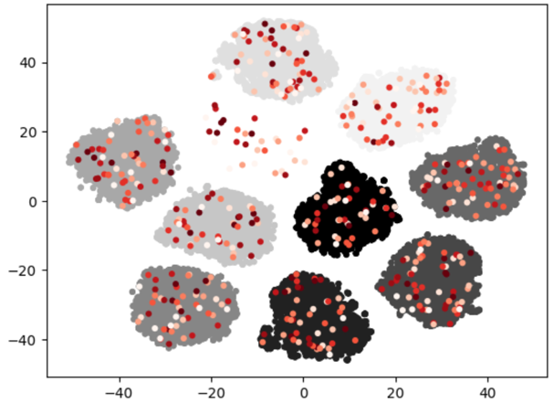
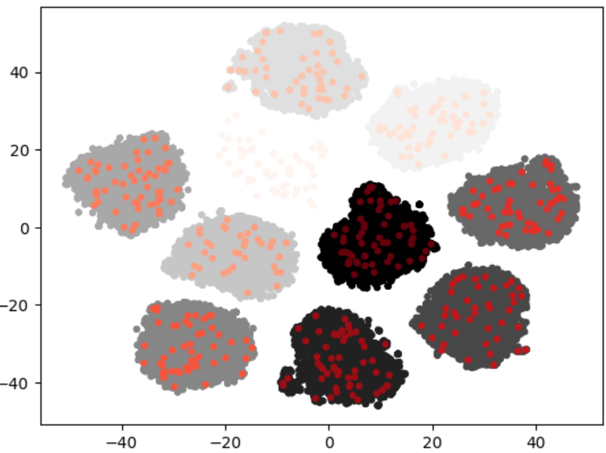
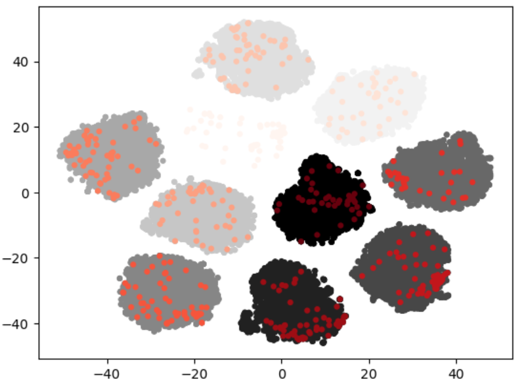

# Prune

## Prune Dataset

This command prunes dataset to extract representative subset of the entire dataset. You can effectively handle large-scale dataset having redundancy through this command. The result consists of a representative and manageable subset.

Prune supports various methodology.
- Randomized
- Hash-based
- Clustering-based

`Randomized` approach is based on the most fundamental form of randomness that we are familiar with, where data is selected randomly from the dataset. `Hash-based` approach operates on hash basis like [Explorer](./explorer.md). The default model for calculating hash is CLIP, which could support both image and text modality. Supported model format is OpenVINO IR and those are uploaded in [openvinotoolkit storage](https://storage.openvinotoolkit.org/repositories/datumaro/models/). `Clustering-based` approach is based on clustering to cover unsupervised dataset either. We compute hashes for the images in the dataset or utilize label data to perform clustering.

By default, datasets are updated in-place. The `-o/--output-dir` option can be used to specify another output directory. When updating in-place, use the `--overwirte` parameter (in-place updates fail by default to prevent data loss), unless a project target is modified.

The current project (`-p/--project`) is also used as a context for plugins, so it can be useful for datasest paths having custom formats. When not specified, the current project's working tree is used.

The command can be applied to a dataset or a project build target, a stage or the combined `project` target, in which case all the project targets will be affected.

Usage:
```
datum prune [TARGET] -m METHOD [-r RATIO] [-h/--hash-type HASH_TYPE]
            [-m MODEL] [-p PROJECT_DIR] [-o DST_DIR] [--overwrite]
```

Parameters:
- `<target>` (string) - Target [dataset revpath](../../user-manual/how_to_use_datumaro.md#dataset-path-concepts).
    By default, prints info about the joined `project` dataset.
- `-m, --method` (string) - Prune method name (default: random).
- `-r, --ratio` (float) - Number how much you want to remain among dataset (default: 0.5).
- `--hash-type` (string) - Hash type based for clustering of `query_clust` (default: img). We support image and text hash to extract feature from datasetitem. To use text hash, put `txt` for `hash-type`.
- `-p, --project` (string) - Directory of the project to operate on (default: current directory).
- `-o, --output-dir` (string) - Output directory. Can be omitted for main project targets (i.e. data sources and the `project`  target, but not intermediate stages) and dataset targets. If not specified, the results will be saved inplace.
- `--overwrite` - Allows to overwrite existing files in the output directory, when it is specified and is not empty.

Examples:
- Prune dataset through clustering random with image hash into ratio 80
```console
datum prune source1 -m cluster_random -h image -r 80
```

### Built-in prune methods
- [`random`](#random) - Select randomly among dataset
- [`cluster_random`](#cluster_random) - Select randomly among clusters
- [`centroid`](#centroid) - Select center of each cluster
- [`query_clust`](#query_clust) - Set init with label of cluster
- [`entropy`](#entropy) - Select dataset based label entropy among clusters
- [`ndr`](#ndr) - Removes duplicated images from dataset

#### `random`
Randomly select items from the dataset. The items are chosen from the entire dataset using the most common random method.
```console
datum prune -m random -r 0.8 -p </path/to/project/>
```

#### `cluster_random`
Select items randomly among each clusters. Cluster the entire dataset using K-means based on the number of labels, and select items from each cluster according to the desired ratio.
```console
datum prune -m cluster_random -r 0.8 -p </path/to/project/>
```


#### `centroid`
Clustering the entire dataset, set the number of desired data samples as the number of clusters. To perform clustering, a desired number of data points is selected as centroids from the entire dataset, based on the desired proportion. Then, the centers of each cluster are chosen.

```console
datum prune -m centroid -r 0.8 -p </path/to/project/>
```


#### `query_clust`
When clustering the entire dataset, set the representative query for each label as the center of the cluster. The representative query is calculated through image or text hash, and one representative query is set for each label. It supports the approach of randomly selecting one item per label and choosing it as the representative query. In the generated clusters, random selection of items is performed according to the desired ratio.
```console
datum prune -m query_clust -h img -r 0.8 -p </path/to/project/>
```

```console
datum prune -m query_clust -h txt -r 0.8 -p </path/to/project/>
```


#### `entropy`
After clustering the entire dataset, items are selected within each cluster based on the desired ratio, considering the entropy of labels.
```console
datum prune -m entropy -r 0.8 -p </path/to/project/>
```


#### `ndr`
Remove near-duplicated images in each subset. You could check detail for this method in [ndr](./transform.md#ndr).
```console
datum prune -m ndr -p </path/to/project/>
```
