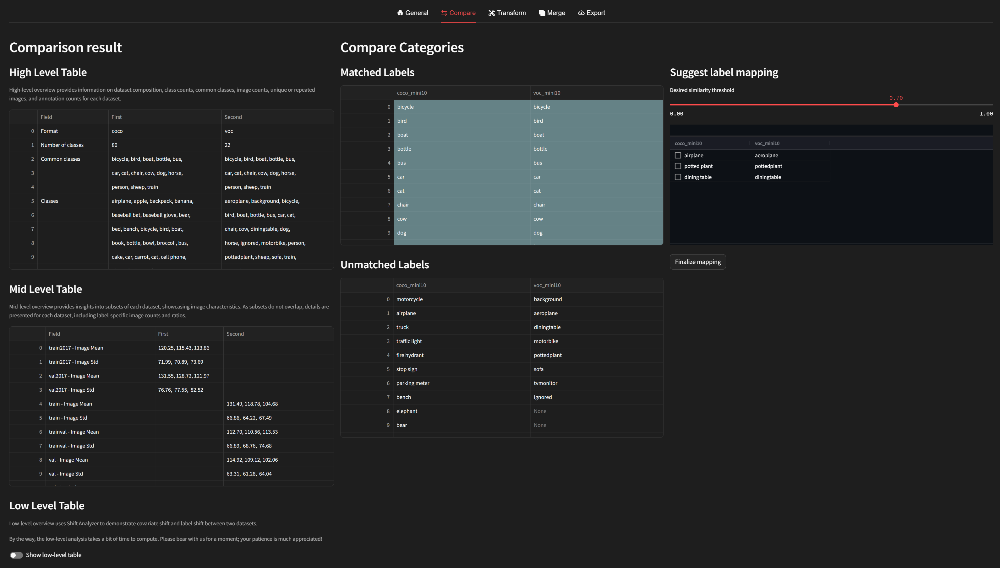
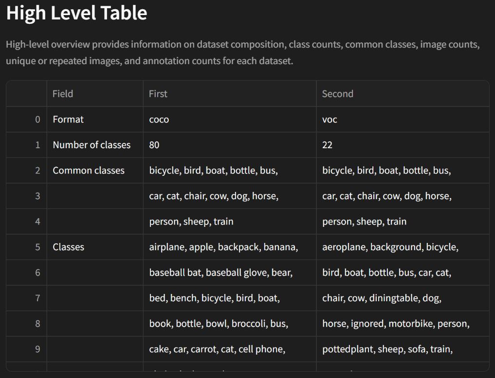
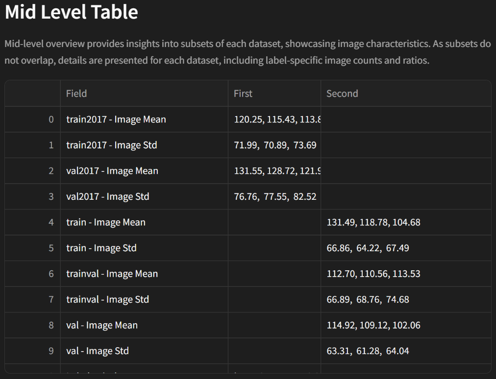
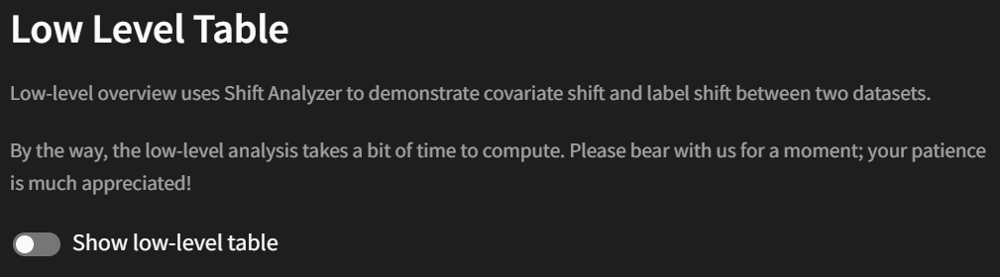
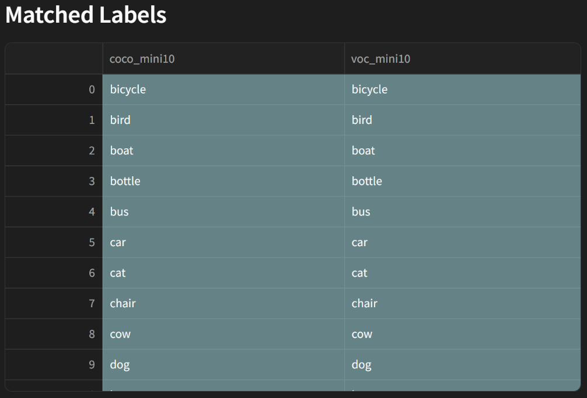
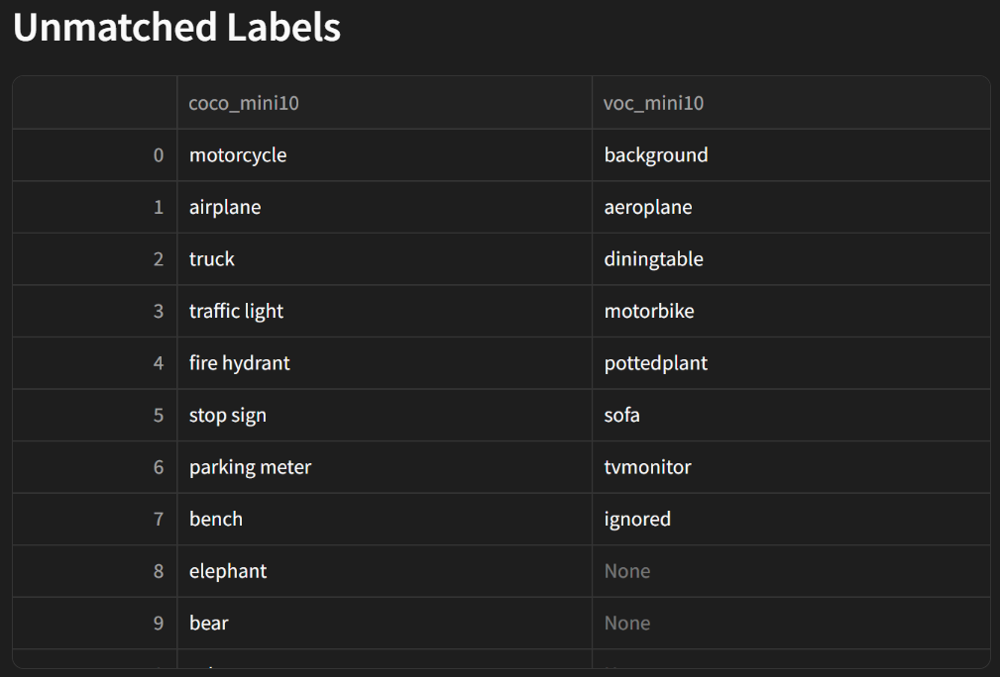
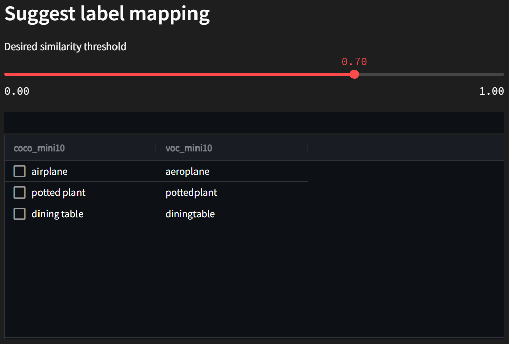
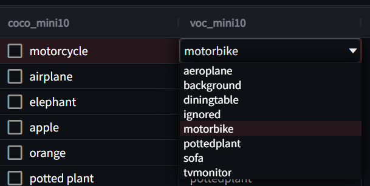
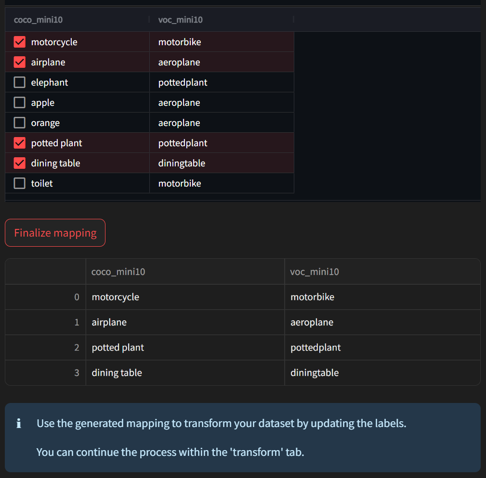

# Compare

If you wish to compare the characteristics of two datasets, simply click on the compare tab. Upon clicking the Compare tab, you'll be presented with the following screen:

The **Comparison result** section provides both High-Level Table and Mid-Level Table by default.

## Comparison Result
### High Level Table

he High-level overview offers a comparison of the overall composition of the datasets, including classes, images, and annotations. It reveals details such as the format of each dataset, the number of classes, the list of classes, and the common classes shared between the datasets. Regarding images, it displays the total number of images, the count of unique images, and repeated images. Finally, for annotations, it showcases the annotation count for each dataset and the count of images without annotations.

### Mid Level Table

The Mid-level overview offers insights into each dataset's subsets. It provides characteristics for each image within each subset, along with the count and ratio of images for each label.

### Low Level Table

The Low-level overview utilizes the Shift Analyzer to explain covariate shift and label shift between the two datasets. For covariate shift, the default method employs the Frechet Inception Distance (FID) method. This measures the distance based on variance, with smaller values indicating greater similarity between the datasets. Label shift, on the other hand, employs the Anderson-Darling test from scipy to assess how well the data follows a normal distribution. Values closer to 0.95 or 0.99 suggest a better fit to the hypothesis, while values lower than 0.95 indicate a reasonable fit to the normal distribution. Calculating these values may take some time due to the computational complexity involved.

## Compare Categories
### Matched & Unmatched Labels

The **Compare Categories** section displays label matching information for label remapping between the datasets. The **Matched Labels** list showcases labels that have been matched, while **Unmatched Labels** displays labels that have not been matched.

### Suggest label mapping
Additionally, it provides suggestions for label remapping based on label names and similarity. Users can adjust the similarity using a slider.

If the suggested mappings are incorrect, they can be modified manually.

After making all necessary modifications, users can check the desired mappings, click the **_"Finalize"_** button, and the mapped labels will be displayed. This information is then passed to the **_"Transform"_** tab for use in remapping.

For further advanced features in comparison, you can follow the instructions provided [here](../../command-reference/context_free/compare.md) to utilize the CLI.
