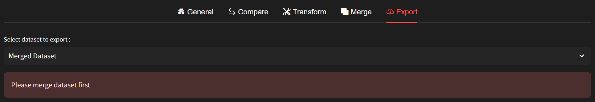

# Export

If you wish to export the Merged dataset, simply click on the export tab. Upon clicking, the following screen will appear.

If there is no merged dataset available, please proceed with the merge first.

It's also advisable to use the 'Save' button if you wish to store the transformed dataset.

Check [supported formats](../../../docs/data-formats/formats/index.rst) for more information about format specifications, supported options, and other details.
The supported export tasks are as follows:
- Classification
- Detection
- Instance Segmentation
- Segmentation
- Landmark

For each task, the supported export formats are as follows:
- **Classification**: datumaro, imagenet, cifar, mnist, mnist_csv, lfw
- **Detection**: datumaro, coco_instances, voc_detection, yolo, yolo_ultralytics, kitti_detection, tf_detection_api, open_images, segment_anything, mot_seq_gt, wider_face
- **Instance Segmentation**: datumaro, coco_instances, voc_instance_segmentation, open_images, segment_anything
- **Segmentation**: datumaro, coco_panoptic, voc_segmentation, kitti_segmentation, cityscapes, camvid
- **Landmark**: datumaro, coco_person_keypoints, voc_layout, lfw

To export the dataset, follow these steps:
1. **Select Dataset to Export:** Choose the dataset you want to export from the options provided.
2. **Select a Format to Export:** Choose the desired format for exporting the dataset.
3. **Specify Export Path:** Input the path where you want to save the exported data.
4. **Export:** Click the **_"Export"_** button to initiate the export process.

The exported data will be saved at the specified path.

For more detailed export functionalities, I recommend following the instructions provided [here](../../command-reference/context/export.md) in the CLI.
