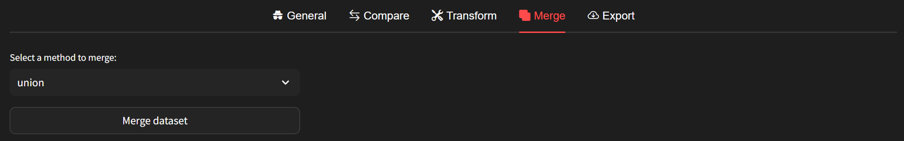
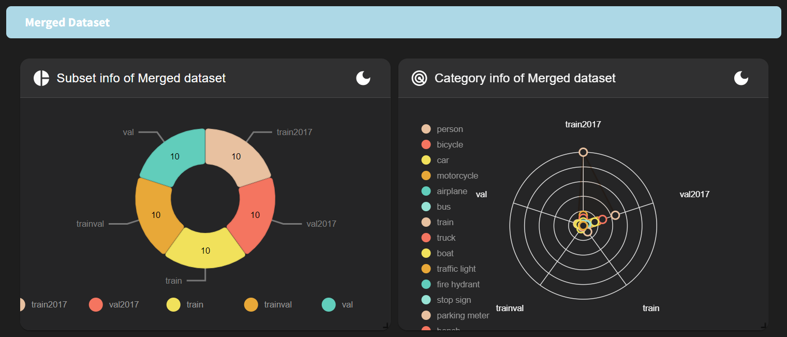

# Merge

If you wish to merge two datasets, simply click on the merge tab. Upon clicking, the following screen will appear.

There are three methods available for merging: **union**, **intersect**, and **exact**. For detailed information on each method, please refer to the [merge](../../command-reference/context_free/merge.md) CLI.

If you have a specific format in mind for the merged dataset, we recommend adjusting each dataset accordingly using transformations before merging. Also, consider the appropriate merge policy for achieving the desired format.

For example, if the subsets of the two datasets are *train2017* and *val2017* for the first dataset, and *train* and *val* for the second dataset, but you want the merged dataset's subsets to be *train* and *val*, I suggest renaming the subsets of the first dataset accordingly. You can achieve this by transforming the datasets before merging.

Once you've completed all checks for each dataset, click the **"Merge dataset"** button.

You can then review the information about the Merged Dataset as shown above. If you wish to apply transformations to the merged dataset, click on the [Transform](../multiple_dataset/transform.md) tab, select the `Merged Dataset` under **Select dataset to transform** dropdown, and proceed.

Furthermore, if you want to export the merged dataset, simply click on the [Export](../multiple_dataset/export.md) tab and proceed.

For more advanced functionalities related to merging, please follow the instructions provided [here](../../level-up/intermediate_skills/07_data_merge.rst) to utilize merging method.
