# Transform

If you wish to apply transformations to two datasets, simply click on the transform tab. Upon clicking the transform tab, you'll be presented with the following screen:

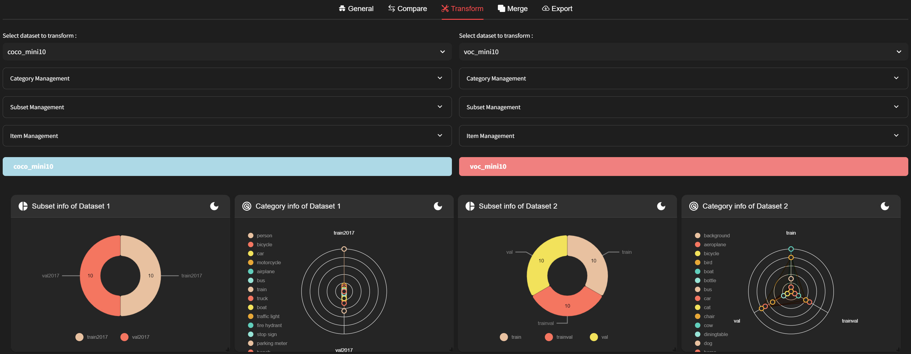

You can apply transformations separately to each dataset. Simply select the desired columns of the dataset to apply the transformations.
You can check the subsets and category info of each dataset in the 'Transform' tab as follows. After applying each transform, you can verify if it has been applied correctly using this information.

DatumaroApp offers the following types of transform manipulations:
Category Management:
- [Label Remapping](#label-remapping):  Renames dataset items by regular expression.

Subset Management:
- [Aggregation](#aggregation): Aggregates subsets into one subset.
- [Split](#split): Splits the dataset into subsets for classification, detection, segmentation, or re-identification.
- [Subset Rename](#rename): Renames and removes subsets.

Item Management:
- [Reindexing](#rename): Renames dataset items with numbers.
- [Filtration](#filtration): Extract a sub-dataset from a dataset through some condition.
- [Remove](#remove): Removes specific images or annotations.
- [Auto-correction](#auto-correction): Correct the dataset from a validation report.

## Category Management
### Label Remapping
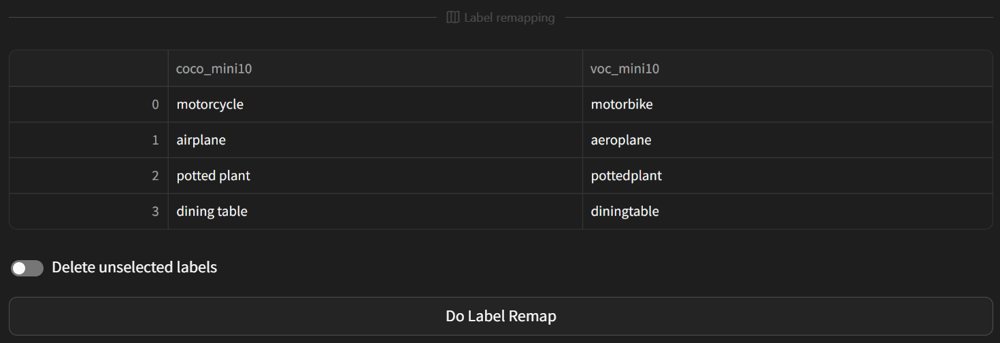

Renames labels in the dataset. For more details, please refer to the [remap_labels](../../command-reference/context_free/transform.md/#remap_labels) CLI. If there is no information available for label remapping between the two datasets, a notification will appear. In such cases, please first navigate to the 'Compare' tab to review the label remapping between the two datasets. Once the labels for remapping are prepared, confirm them and click the 'Do Label Remap' button to proceed. If you wish to remove all labels except for the selected ones, please toggle the 'Delete unselected labels' option.

## Subset Management
### Aggregation
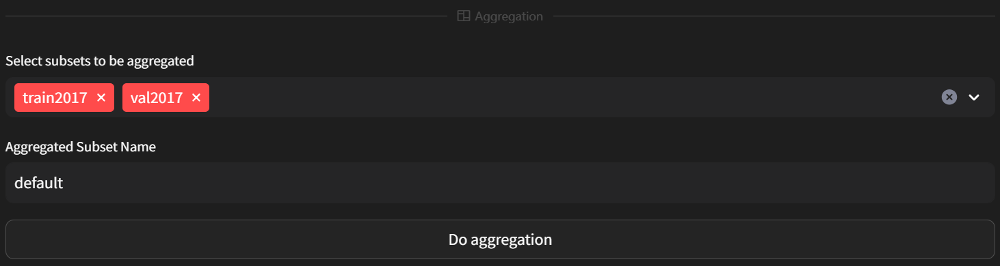

Merges subsets of the dataset into one. For more details, please refer to [data_aggregation](../../level-up/intermediate_skills/05_data_aggregation.rst). Select the subsets to be aggregated, and provide a name for the aggregated subset. Once done, click the 'Do aggregation' button to proceed.

### Split
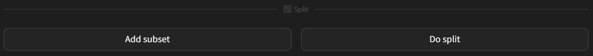
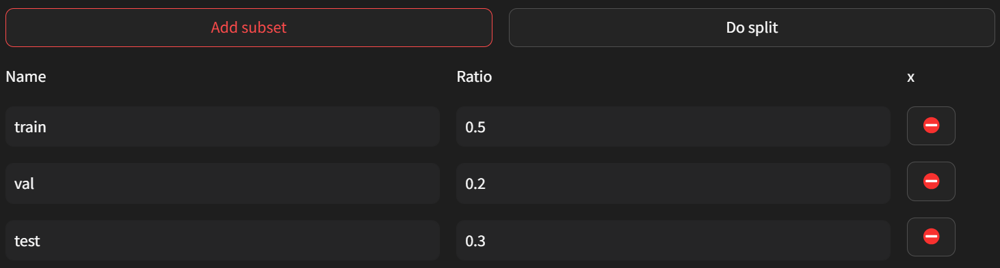

Combines all subsets of the dataset into one and then divides them into multiple subsets. For more details, please refer to the [random_split](../../command-reference/context_free/transform.md#random_split) CLI. Clicking the 'Add subset' button will display the names and ratios for creating subsets. The total ratio sum of subsets must be 1 for the split to proceed. By default, the values are set to 0.5, 0.2, and 0.3 for train, val, and test subsets respectively. Click 'Add subset' thrice to confirm. Once the names and ratios are set, click the 'Do split' button to proceed.

### Rename
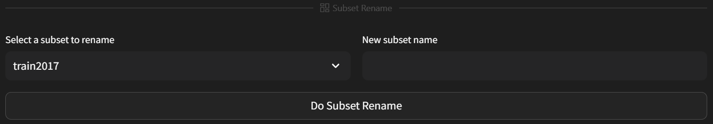

Renames the subsets of the dataset. For more details, please refer to [map_subsets](../../command-reference/context_free/transform.md#map_subsets) CLI. Select the subset to rename, provide a new name, and click the 'Do Subset Rename' button to proceed.

### Reindex
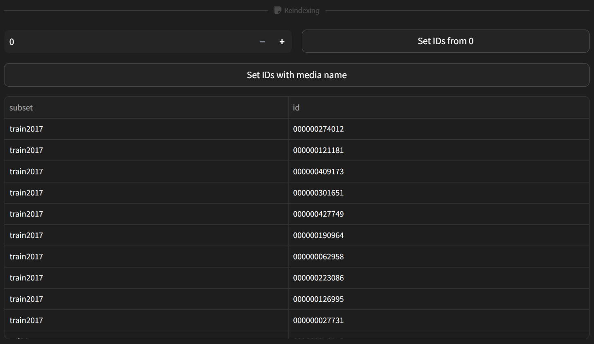

Reindexing involves changing the IDs of items in the dataset. For detailed information, please refer to the [reindex](../../command-reference/context_free/transform.md#reindex) CLI.
If you wish to reindex based on numbers, please input the desired starting index. The default value is 0, and reindexing will start from this value. Once you've input the starting index, click the 'Set IDs from 0' button. If you've input a value other than 0, it will be reflected on the button instead.
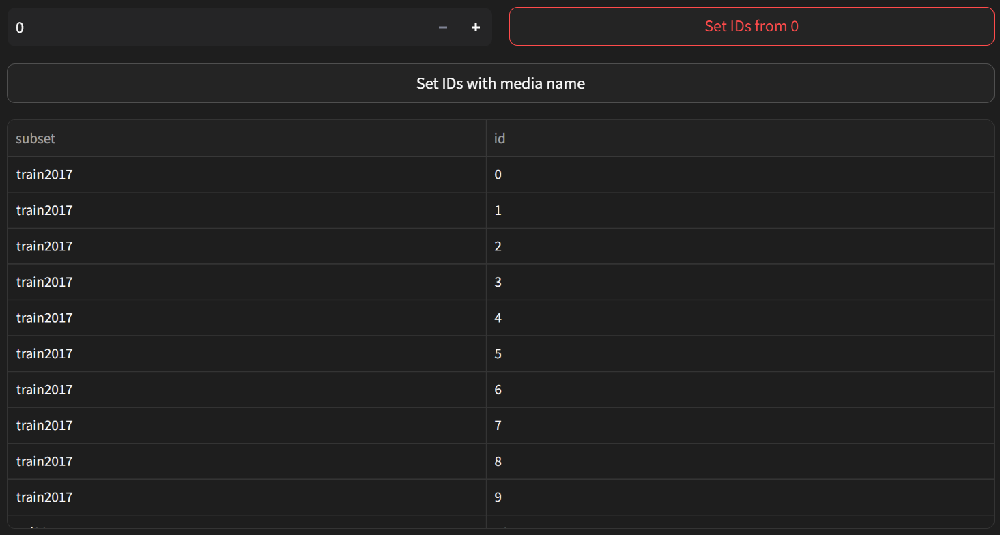

Please review the item ID table below to ensure that the reindexing has been done correctly.

If you prefer to reindex based on media name, click the 'Set IDs with media name' button.

### Filtration
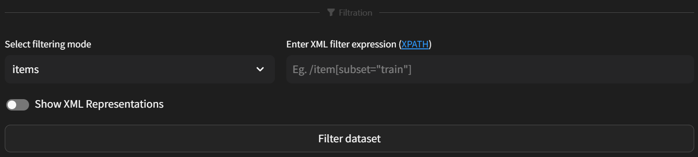

Filtering involves extracting sub-datasets from the dataset using filters. For detailed information, please refer to the [filter](../../command-reference/context_free/filter.md) CLI.

DatumaroApp offers three filtering modes: `items`, `annotations`, and `item+annotations`. After selecting the desired mode, you can write an XML expression describing how the filtering should be performed.

For example:
- If you want to extract images where the height is greater than the width, you can use the expression `/item[image/width < image/height]`.
- If you want to extract only the images from the 'train' subset, you can use the expression `item[subset="train"]`.
- If you want to extract images with annotations labeled as 'cat', you can switch the filtering mode to 'annotation' and use the expression `/item/annotation[label="cat"]`.
Feel free to customize the filter expression as needed.

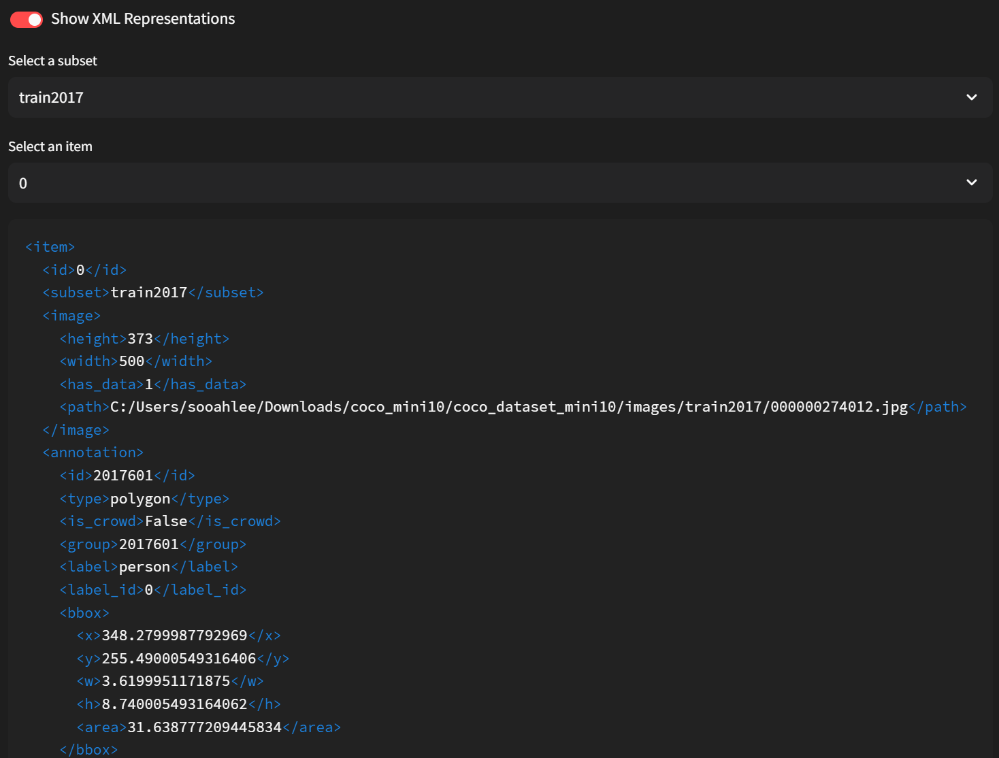

If you wish to examine the detailed information of each item in the dataset before writing the filter, you can toggle the 'Show XML Representation' to access the detailed information of each item.

Once you have prepared the filter expression, click the 'Filter Dataset' button to proceed.

### Remove
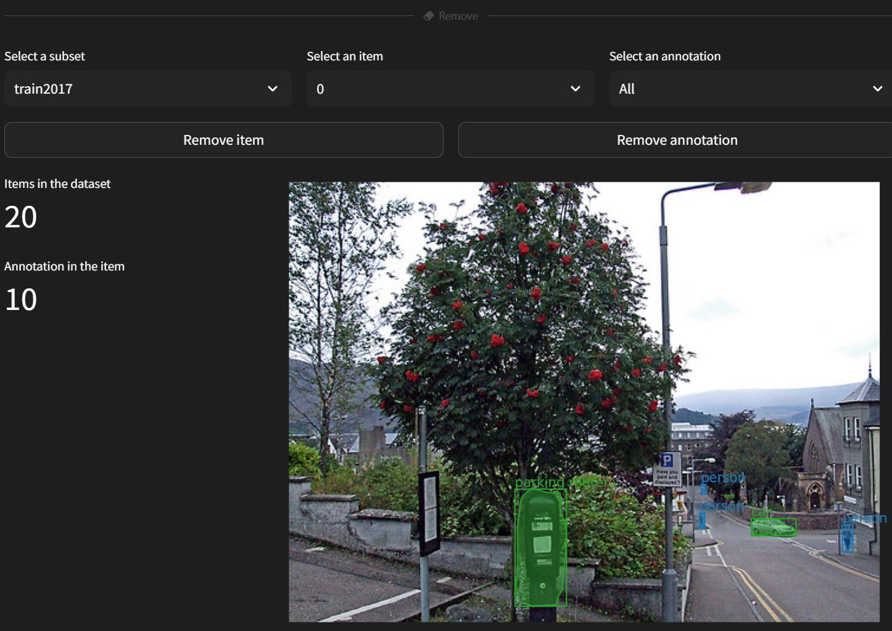
Removing involves deleting specific items or annotations within the dataset. For detailed information, please refer to the [remove_images](../../command-reference/context_free/transform.md#remove_images) and [remove_annotations](../../command-reference/context_free/transform.md#remove_annotations) CLI.

Through `Select a subset` to choose the subset where you want to apply the removal, and then select the item you wish to remove through `Select an item`.

You can view information about the annotations for that item using the visualizer below. By default, all annotations are displayed, but if you want to view specific annotations, simply select them.

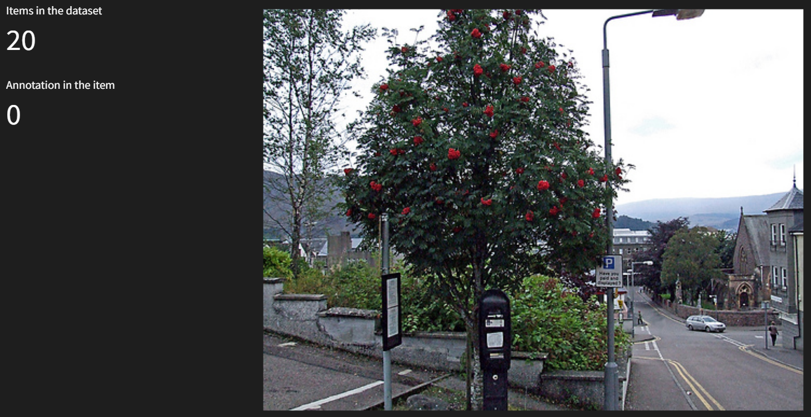
To delete the selected item, use the `Remove item` button. If you wish to remove specific annotations, use the `Remove annotation` button to proceed.

### Auto Correction
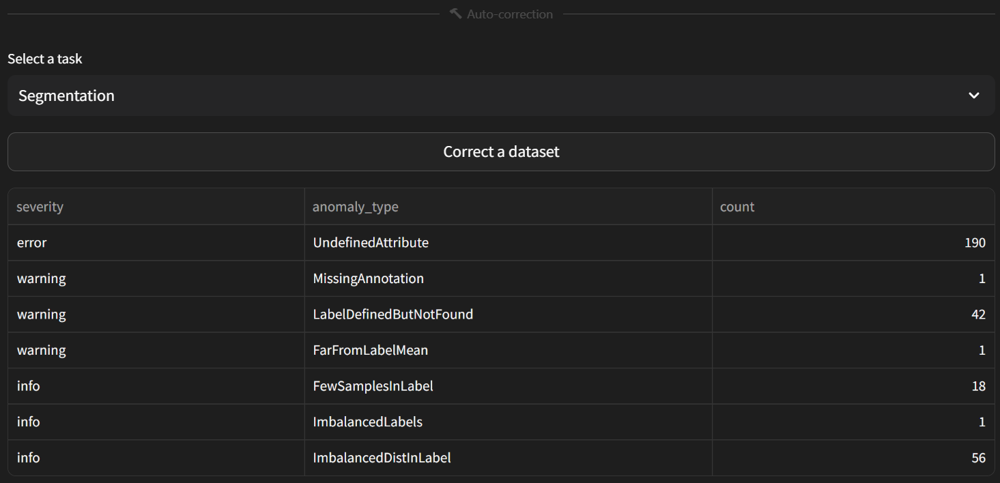

Correcting involves assessing the characteristics of the dataset and automatically correcting any inaccuracies. The dataset is refined based on the validation report, rejecting undefined labels, missing annotations, and outliers.

For detailed information on validation, please refer to the [validate](../../command-reference/context_free/validate.md) CLI.

Select the task for which you want to validate the dataset using the 'Select a task' dropdown menu. The validation report for that task will be displayed below. Review the characteristics and if you wish to correct the dataset, click the 'Correct a dataset' button.

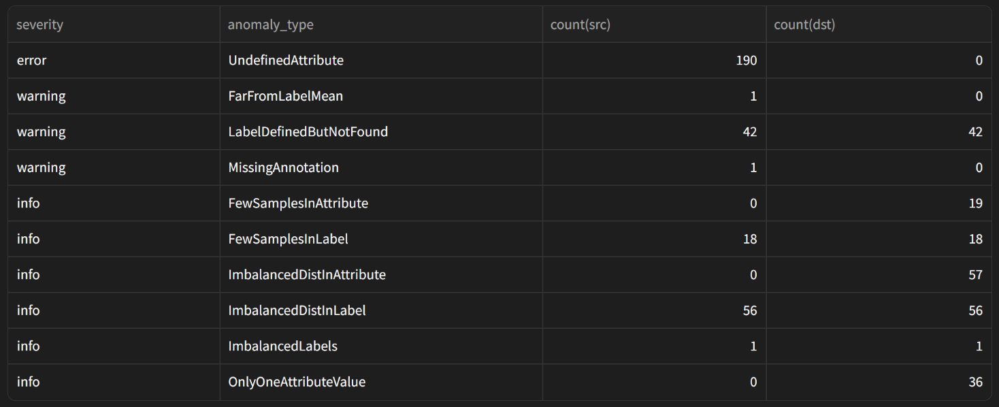
You can see how the dataset has been refined. In this example, corrections have been made for items classified as UndefinedAttribute, FarFromLabelMean, and MissingAnnotation.

For more detailed functionalities of transformations, please follow the instructions provided [here](../../command-reference/context_free/transform.md) to utilize the CLI.
