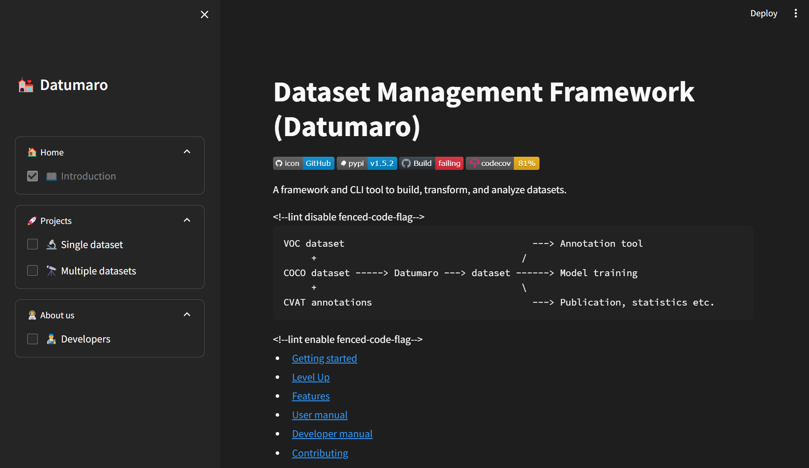

========
Overview
========

Datumaro stands as a robust framework tailored for data management and annotation tasks.
It serves as a versatile tool for organizing and annotating image, video, and text datasets with ease.
Datumaro boasts support for various data formats and extends the capability for users to implement
custom formats as required. The framework encompasses a rich array of functionalities, enabling users
to create, transform, inspect, and visualize datasets efficiently.

DatumaroApp, the graphical user interface companion to Datumaro, provides users with an intuitive
platform to navigate these extensive capabilities. Through DatumaroApp, users can seamlessly handle
intricate data management and annotation tasks, alleviating the need for intricate coding or command-line
expertise.

Whether working with a ``single dataset`` (:ref:`Single Dataset`) or ``multiple datasets`` (:ref:`Multiple Datasets`),
DatumaroApp accommodates both scenarios seamlessly.

If you wish to work on a single dataset, simply select *Single dataset* from the sidebar. Once you've chosen the file
of the dataset you'd like to inspect, you'll be prompted to select from the detected formats in which the file can be
imported. While the data will be automatically imported in the detected format, you have the option to change it if
you prefer another format.

In `Single Dataset` Mode, users gain swift access to dataset overviews and delve into detailed tasks such as:

- **General** (:ref:`General`): Get detailed information about dataset
- **Analyze** (:ref:`Analyze`): Deep dive into detailed information about the dataset and its internal items
- **Visualize** (:ref:`Visualize`): Display a specific item in the dataset
- **Explore** (:ref:`Explore`): Search data items for dataset using specific labels, particular images or texts
- **Transform** (:ref:`Transform`): Implement changes to the dataset through transformations
- **Export** (:ref:`Export`): Export the modified dataset after applying transformations

If you wish to work with multiple datasets, simply select *Multiple datasets* from the sidebar. Once you've selected the
files of the datasets you'd like to inspect, you'll be prompted to choose from the detected formats in which the files
can be imported. While the data will be automatically imported in the detected format, you have the option to change it
if you prefer another format. Currently, for multiple datasets, support is available for two datasets.

Conversely, `Multiple Datasets` Mode empowers users to work across multiple datasets simultaneously,
offering functionalities such as:

- **General** (:ref:`General`): Get detailed information about dataset
- **Compare** (:ref:`Compare`): Analyze the attributes of two datasets for comparison
- **Transform** (:ref:`Transform`): Implement changes to the dataset through transformations
- **Merge** (:ref:`Merge`): Combine two datasets into one
- **Export** (:ref:`Export`): Export the modified dataset after applying transformations

DatumaroApp streamlines the dataset management process, ensuring efficiency and ease of use for all users,
regardless of their level of expertise. Let us embark on this journey of effective dataset management
and annotation together.
