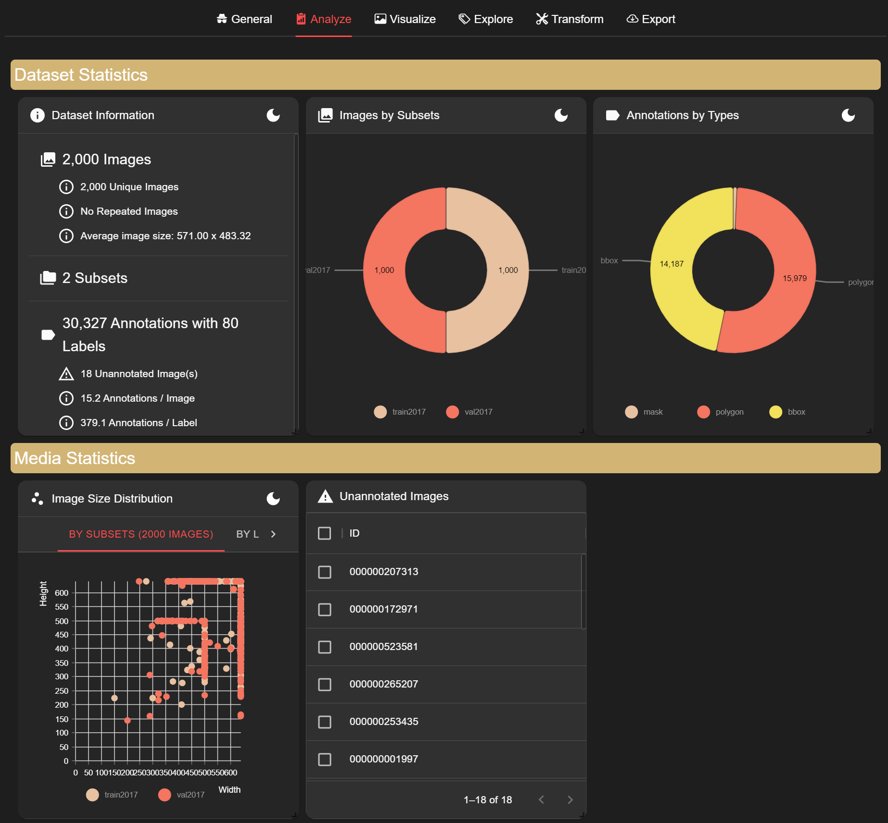
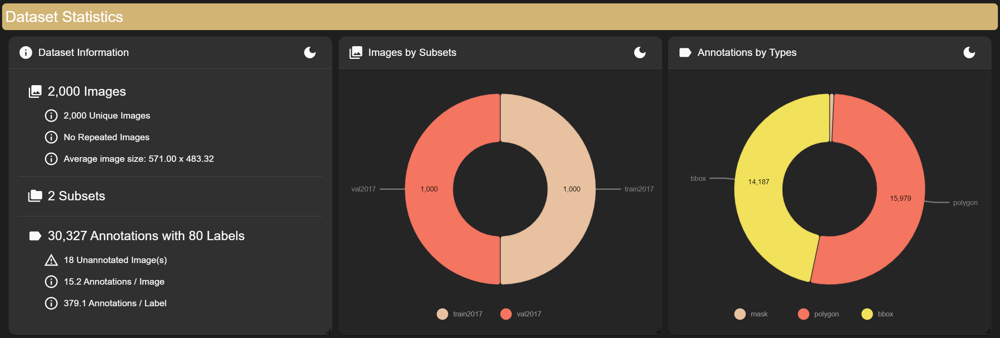
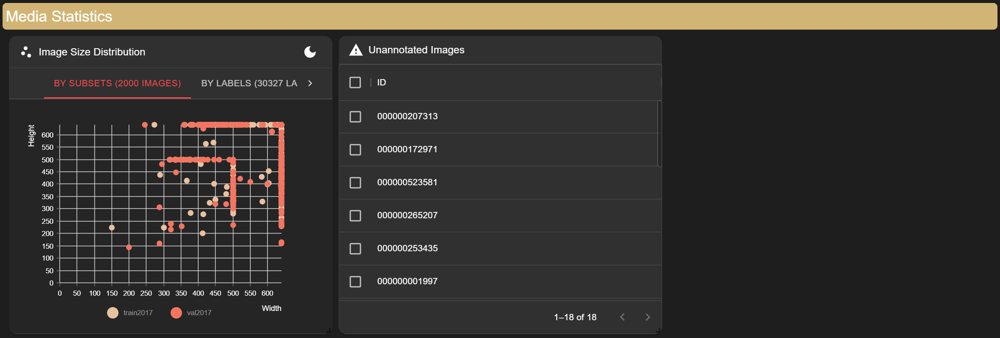
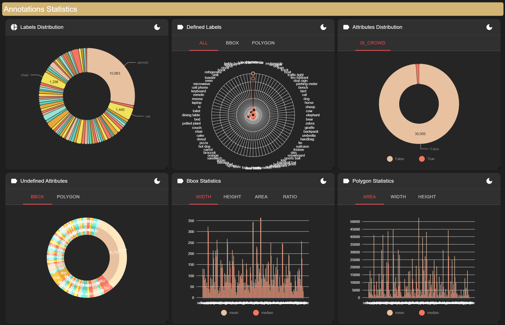
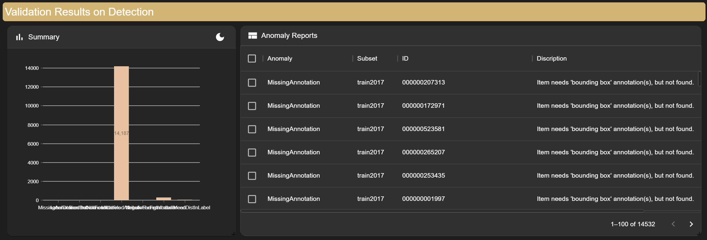
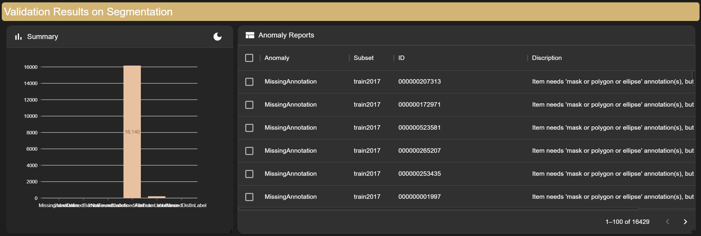

# Analyze

If you want to delve into detailed information about the dataset and its internal items, you can press the analyze tab. Pressing the analyze tab will display the following screen:

Analyze consists of [Data Statistics](#data-statistics), [Media Statistics](#media-statistics), [Annotations Statistics](#annotations-statistics), and [Validation Results on Each Task](#validation-results-on-each-task).

## Data Statistics

Data Statistics include Dataset Information, Images by Subsets, and Annotations by Types.
- **Dataset Information** provides an overview of the dataset, including the total number of images, repeated images, average image size, number of classes, and total number of annotations. You can also find information about unannotated images, the average number of annotations per image, and the average frequency of each label across the dataset.
- **Images by Subsets** displays the number of subsets, their names, and the number of images in each subset.
- **Annotations by Types** shows the types of annotations present in the dataset and the count of each annotation type.

## Media Statistics

Media Statistics include Image Size Distribution and Unannotated Images.
- **Image Size Distribution** shows the distribution of image sizes across subsets or labels. For example, you can see how the size distribution varies across different subsets.
- **Unannotated Images** display the IDs of images without annotations.

## Annotations Statistics

Annotations Statistics provide information such as Labels Distribution, Defined Labels, Undefined Labels, Attributes Distribution, Defined Attributes, Undefined Attributes, Bbox Statistics, and Polygon Statistics, tailored to the dataset's needs.
- **Labels Distribution** shows the count and percentage of each label across the dataset.
- **Defined Labels** and **Undefined Labels** illustrate how each label is structured in terms of annotation types.
- **Attributes Distribution** displays the distribution of attributes among annotations.
- **Defined Attributes** and **Undefined Attributes** show the distribution of items where attributes are either defined or undefined in the metadata.
- **Bbox Statistics** provide mean and median values for width, height, area, and ratio of bounding boxes.
- **Polygon Statistics** offer mean and median values for width, height, and area of polygons.

## Validation Results on Each Task

Validation Results on Each Task display results for tasks such as classification, detection, or segmentation, depending on the annotation types present in the dataset. You can view summary distributions and detailed anomaly reports for each task. The table allows sorting and filtering by various attributes to customize your analysis.
