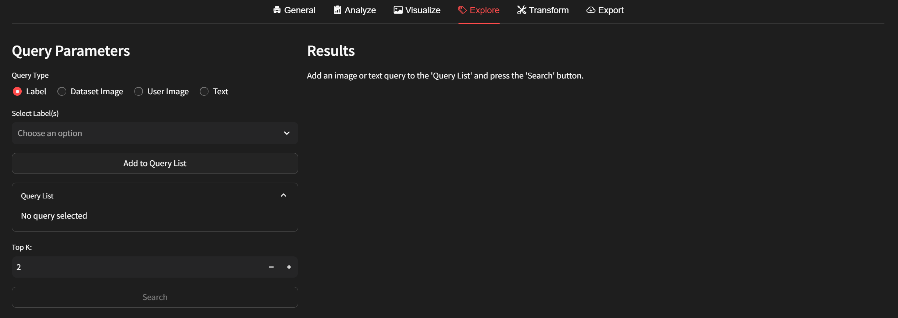
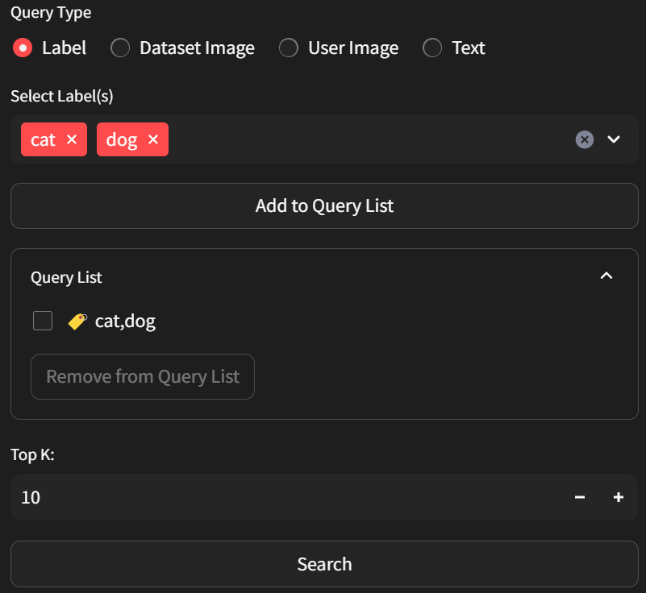
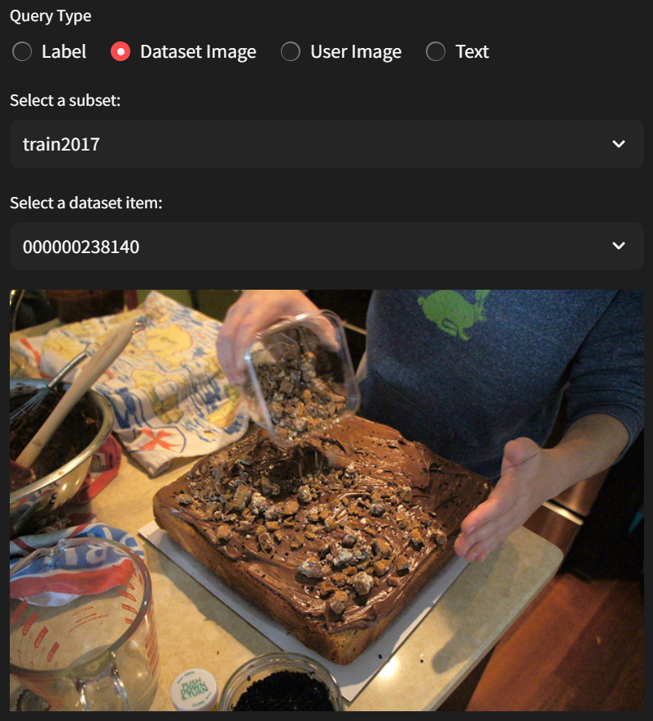
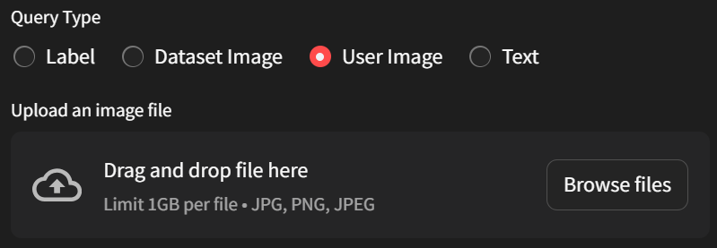
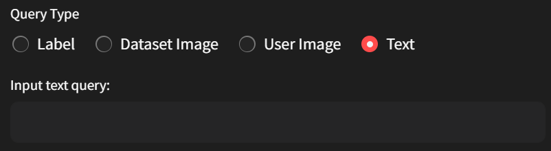
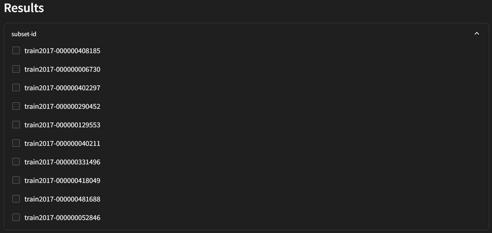
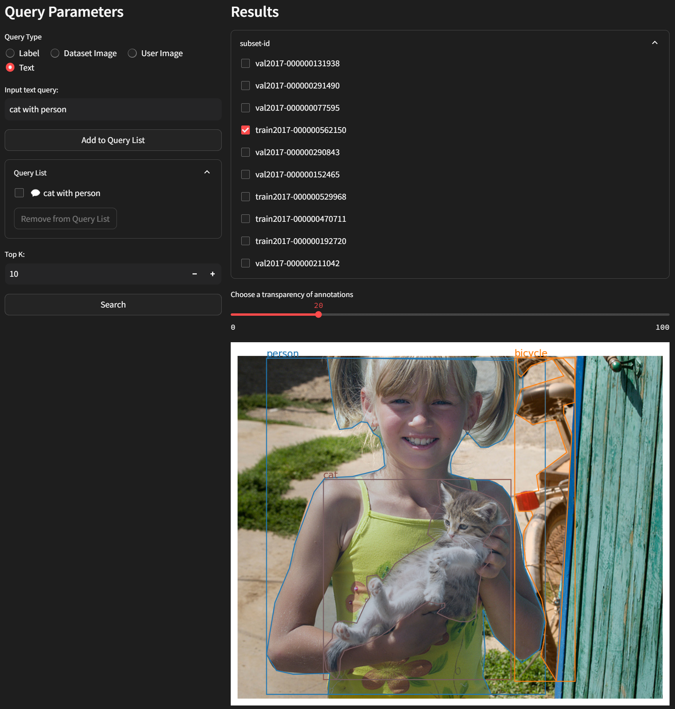

# Explore

If you want to find data items containing specific labels or if you want to find datasets based on certain images or texts, you can press the explore tab. Pressing the explore tab will display the following screen:

You can use queries in Label, Dataset Image, User Image, and Text formats. Please choose the Query Type according to your needs.

## Query Type
### Label Query

For **Label**, it's recommended if you want to find items containing a specific label.

### Dataset Image Query

For **Dataset Image**, it's recommended if you want to find items with similar images within the dataset.

### User Image Query

For **User Image**, it's recommended if you want to find items with similar external images.

### Text Query

For **Text**, you can use it for general search purposes.

Please add queries to the Query List using the Add to Query List button. If you want to use multiple queries, add all the queries you want to use to the Query List. After setting up all the queries, please specify how many similar items you want to find in total using the Top K parameter. Once everything is set up, press the Search button.

## Result

You will then obtain search results consisting of subset-ids. If you want to visualize a specific item, you can click on it to view.

For example, if you want to find images containing `cats with people`, you can enter this query. Then you'll see images containing both cats and people in the results.

For detailed information on each method, please refer to the [explorer](../../command-reference/context_free/explorer.md).
