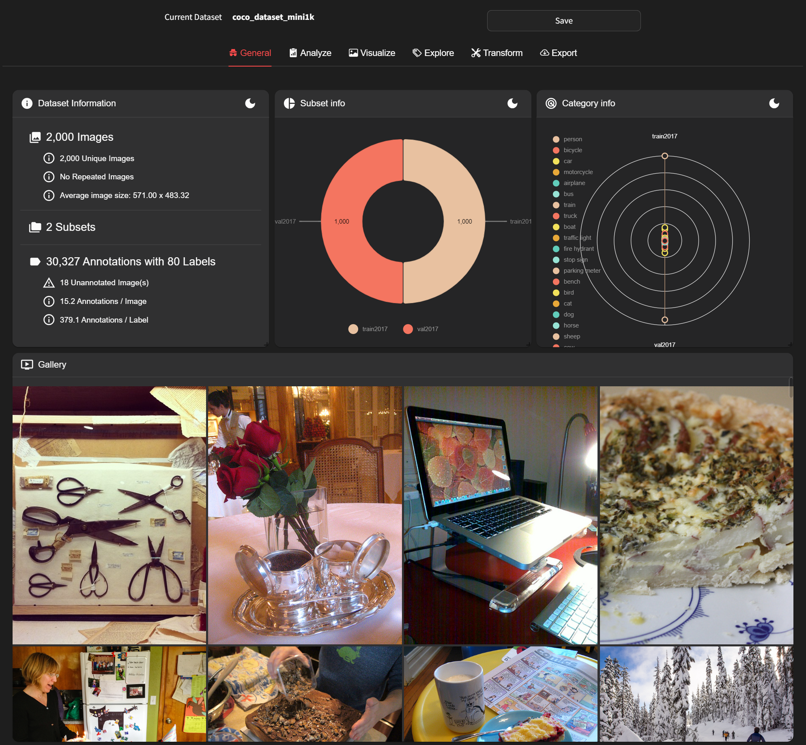

# General

Through the single dataset option, you can access detailed information about that specific dataset. When you import the dataset, the following screen appears:

You can review the dataset's path and its format. Additionally, you can obtain rough information about each dataset. Firstly, you can see the subsets within each dataset and the number of items in each subset. Moreover, you can identify the categories present in the entire dataset and the number of annotations corresponding to each category. You can also use the gallery to directly inspect some of the items in each dataset.

If you want to save an intermediate form of the dataset after applying multiple transforms while using DatumaroApp, you can press the **Save** button at any time. The file will be saved with the timestamp of when you clicked Save. It will be saved in the datumaro format, so remember that if you want to review it later.
