# Transform

If you want to apply transformations to the dataset, you can press the transform tab. Pressing the transform tab will display the following screen:

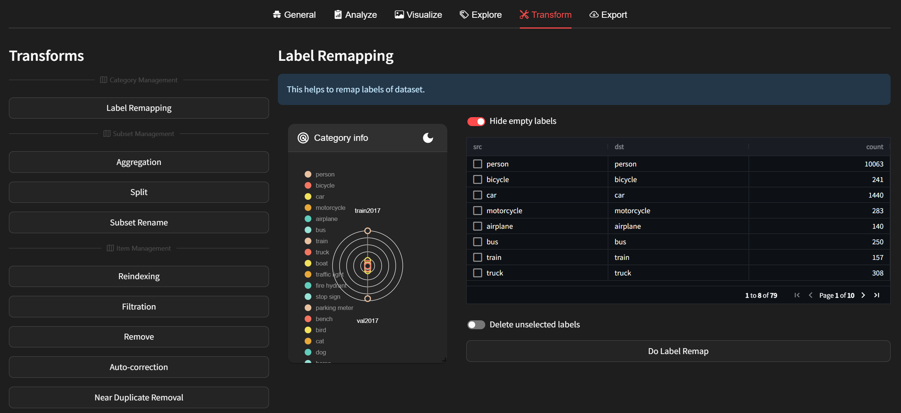

DatumaroApp offers the following types of transform manipulations:
Category Management:
- [Label Remapping](#label-remapping):  Renames dataset items by regular expression.

Subset Management:
- [Aggregation](#aggregation): Aggregates subsets into one subset.
- [Split](#split): Splits the dataset into subsets for classification, detection, segmentation, or re-identification.
- [Subset Rename](#rename): Renames and removes subsets.

Item Management:
- [Reindexing](#rename): Renames dataset items with numbers.
- [Filtration](#filtration): Extract a sub-dataset from a dataset through some condition.
- [Remove](#remove): Removes specific images or annotations.
- [Auto-correction](#auto-correction): Correct the dataset from a validation report.
- [Near Duplicate Removal](#near-duplicate-removal): Removes near-duplicated images in subset.

## Category Management
### Label Remapping
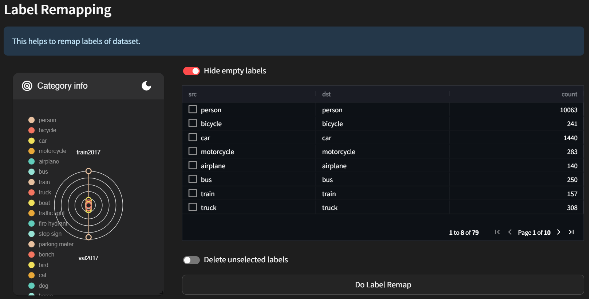

This involves renaming labels in the dataset. For detailed instructions, refer to the [remap_labels](../../command-reference/context_free/transform.md/#remap_labels) CLI.
The table displays the names and counts of dataset labels. Find the label you want to remap, change it in the **dst** column to the desired name, and check the checkbox. If you want to see all empty labels, turn on the **Hide empty labels** toggle.
Once you've set up the desired label changes, press the **Do Label Remap** button to proceed. If you want to remove all unselected labels, turn on the **Delete unselected labels** toggle.
Check the Category info to verify that the changes have been applied.

## Subset Management
### Aggregation
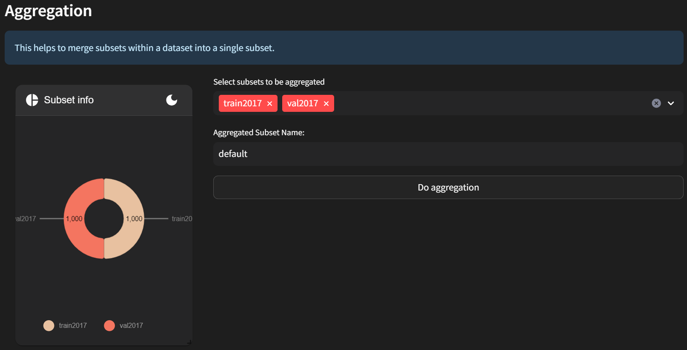

This involves combining subsets of the dataset into one. For detailed instructions, refer to the [data_aggregation](../../level-up/intermediate_skills/05_data_aggregation.rst) CLI.
Select the subsets to be aggregated and specify the name for the aggregated subset. Once everything is set up, press the "**Do aggregation**" button to proceed.
Check the Subset info to verify that the changes have been applied.

### Split
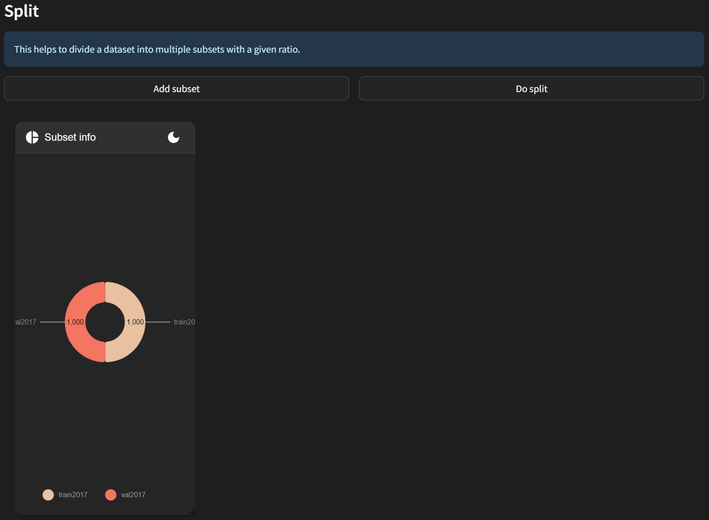
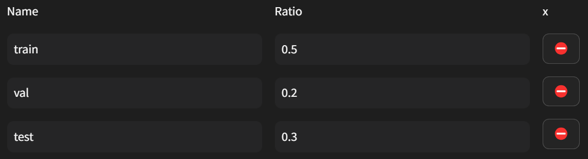

This involves splitting all subsets of the dataset into several subsets. For detailed instructions, refer to the [random_split](../../command-reference/context_free/transform.md#random_split) CLI.
**Add subset** to split by specifying their names and ratios. The total ratio of subsets must be 1 for the split to proceed. By default, the values are set to 0.5, 0.2, and 0.3 for train, val, and test subsets respectively. Once everything is set up, press the **Do split** button to proceed.
Check the Subset info to verify that the changes have been applied.

### Rename
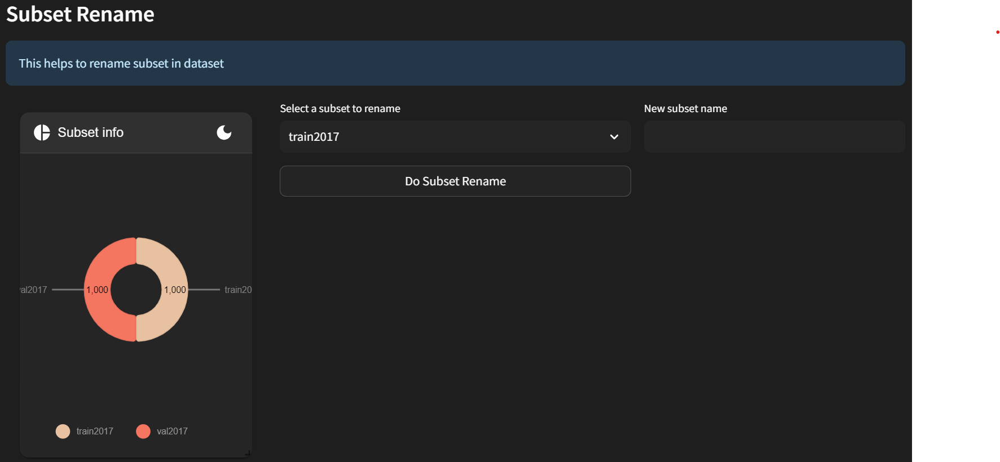

This involves renaming subsets of the dataset. For detailed instructions, refer to the [map_subsets](../../command-reference/context_free/transform.md#map_subsets) CLI.
Select the subset to rename and specify the new name. Once everything is set up, press the **Do Subset Rename** button to proceed.
Check the Subset info to verify that the changes have been applied.

## Item Management
### Reindex
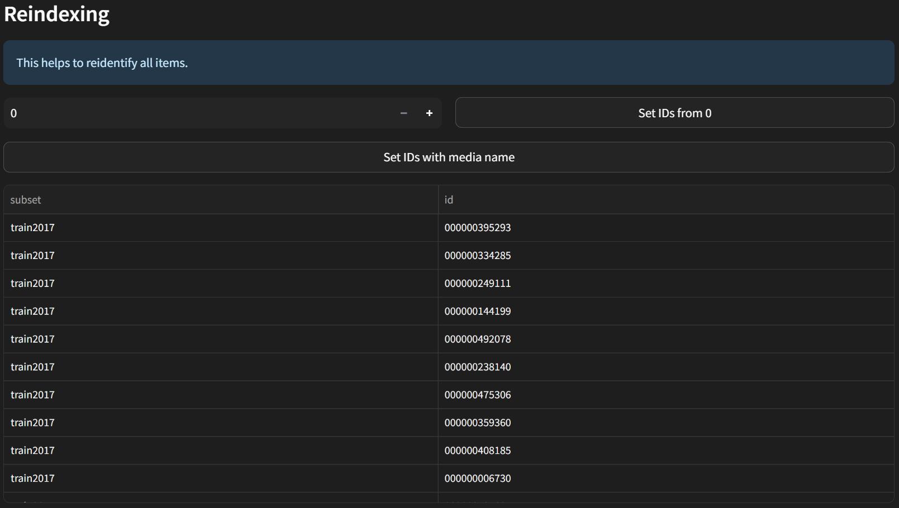
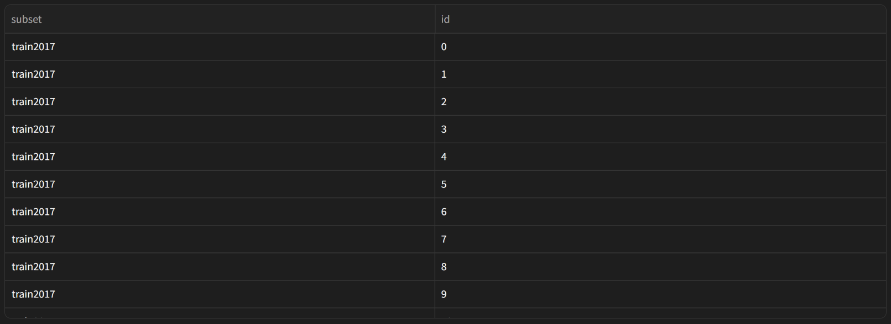

This involves renaming item IDs in the dataset. For detailed instructions, refer to the [reindex](../../command-reference/context_free/transform.md#reindex) CLI.
Specify the starting index for reindexing. The default is 0. If you've entered a different value, press the **Set IDs from 0** button to apply it.
If you want to reindex based on media name, press the **Set IDs with media name** button.
Check the item ID table to verify that the reindexing has been done correctly.

### Filtration
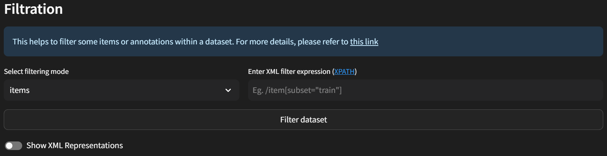

DatumaroApp offers three filtering modes: `items`, `annotations`, and `item+annotations`. After selecting the desired mode, you can write an XML expression describing how the filtering should be performed.

For example:
- If you want to extract images where the height is greater than the width, you can use the expression `/item[image/width < image/height]`.
- If you want to extract only the images from the 'train' subset, you can use the expression `item[subset="train"]`.
- If you want to extract images with annotations labeled as 'cat', you can switch the filtering mode to 'annotation' and use the expression `/item/annotation[label="cat"]`.
Feel free to customize the filter expression as needed.

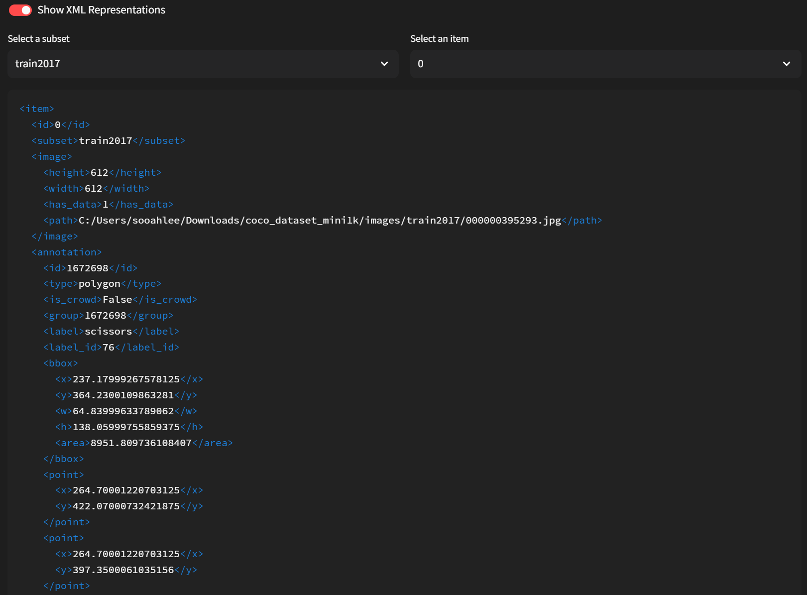
If you wish to examine the detailed information of each item in the dataset before writing the filter, you can toggle the **Show XML Representation** to access the detailed information of each item.
Once everything is set up, press the **Filter Dataset** button to proceed.

### Remove
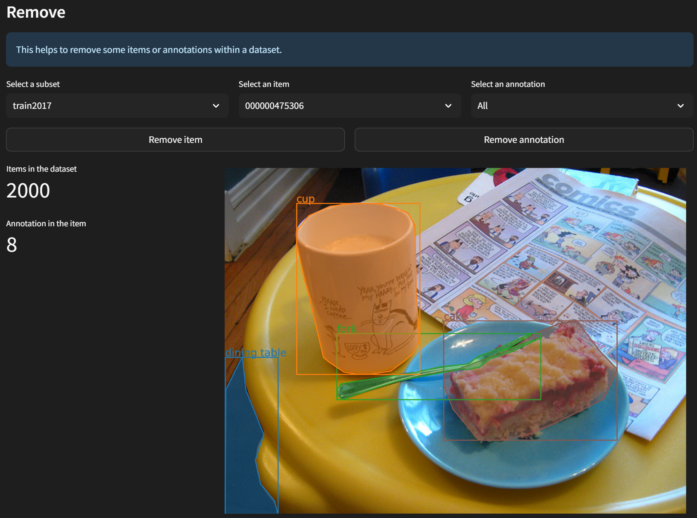

This involves removing specific items or annotations from the dataset. For detailed instructions, refer to the [remove_images](../../command-reference/context_free/transform.md#remove_images) and [remove_annotations](../../command-reference/context_free/transform.md#remove_annotations) CLI.
Through **Select a subset** to choose the subset where you want to apply the removal, and then select the item you wish to remove through **Select an item**.
You can view information about the annotations for that item using the visualizer below. By default, all annotations are displayed, but if you want to view specific annotations, simply select them.
If you want to remove the item, press the **Remove item** button. If you want to remove a specific annotation, select it and press the **Remove annotation** button.

### Auto Correction
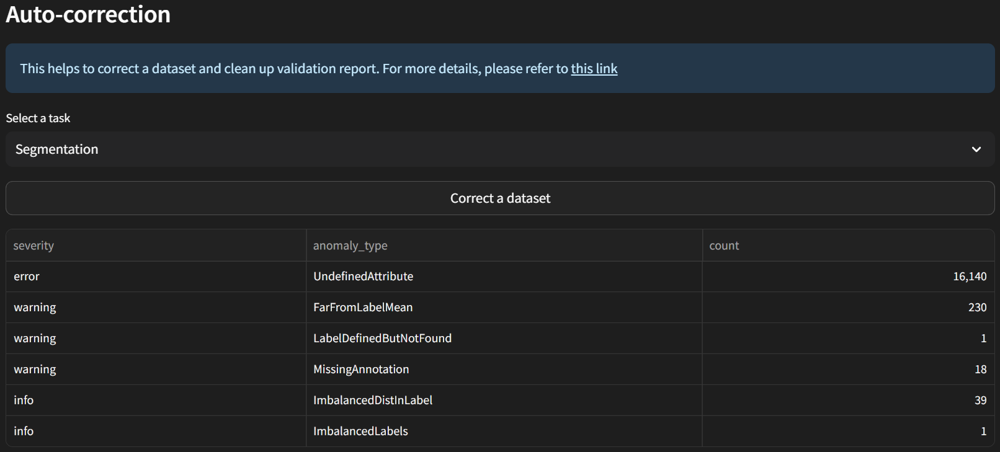

This involves correcting dataset features based on the validation report. The dataset is refined based on the validation report, rejecting undefined labels, missing annotations, and outliers. For detailed instructions, refer to the [validate](../../command-reference/context_free/validate.md) CLI.
**Select a task** for which you want to validate the dataset. The validation report will be displayed below. If you want to correct the dataset based on the report, press the **Correct a dataset** button.

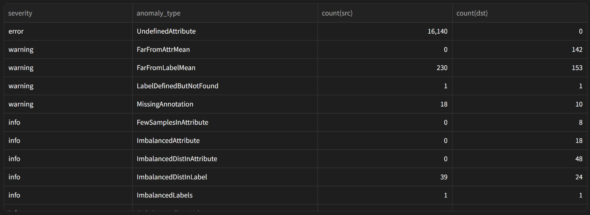
You can see how the dataset has been refined. In this example, corrections have been made for items classified as like UndefinedAttribute, FarFromAttrMean, FarFromLabelMean, and MissingAnnotation.

#### Near Duplicate Removal

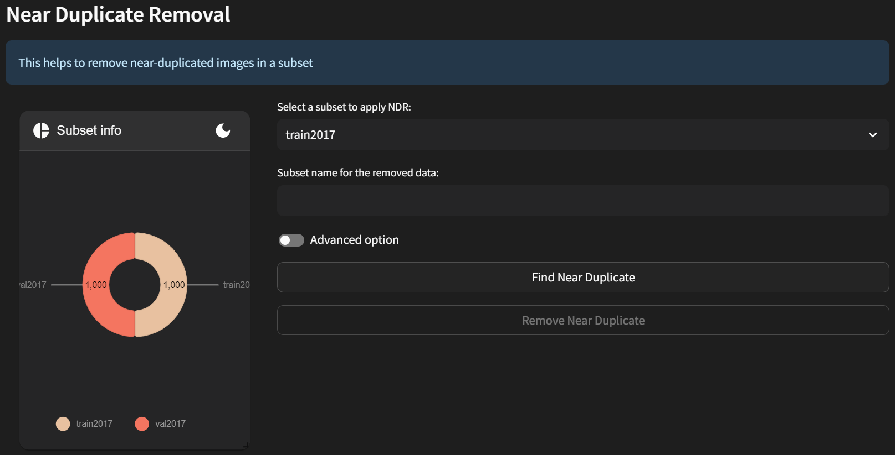

This involves removing near-duplicated images from the dataset subset. For detailed instructions, refer to the [ndr](../../command-reference/context_free/transform.md#ndr) CLI.
Through **Select the subset to apply NDR**, choose the subset from which you want to remove near-duplicated images.
And Enter the name you want to assign to the subset after near-duplicated images are removed in the **Subset name for the removed data** field.
If you want to provide more detailed options, turn on the **Advanced option** toggle.

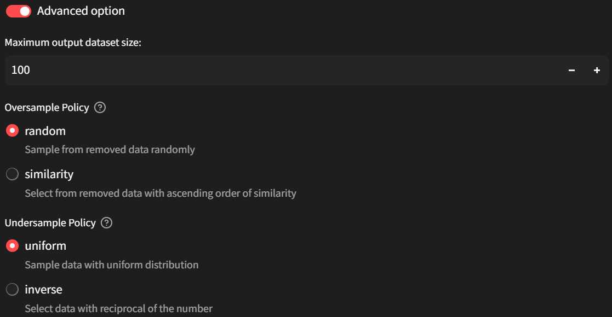

Specify the maximum output dataset size and choose the oversample and undersample policies. These policies help refine the selection process based on whether the number of images to be removed exceeds or is less than the length of the result after removal.

For oversample policy, choose between random and similarity methods.
The **random** method randomly selects the data to be removed.
The **similarity** method selects data based on their similarity values, preferring higher similarity values.

For undersample policy, choose between uniform and inverse methods.
The **uniform** method samples data based on a uniform distribution.
The **inverse** method samples data based on the reciprocal of the number of items with the same similarity.

Once everything is set up, press the **Find Near Duplicate** button. If duplicated images are found, the **Remove Near Duplicate** button will be enabled. Press it to proceed.

For more detailed functionalities of transformations, please follow the instructions provided [here](../../command-reference/context_free/transform.md) to utilize the CLI.
