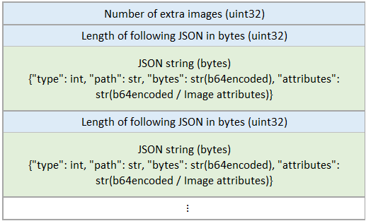
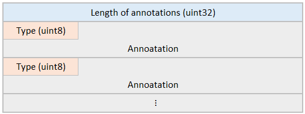
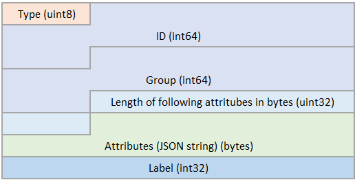
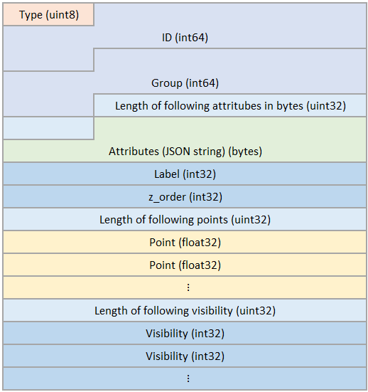
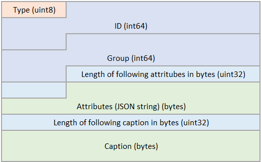
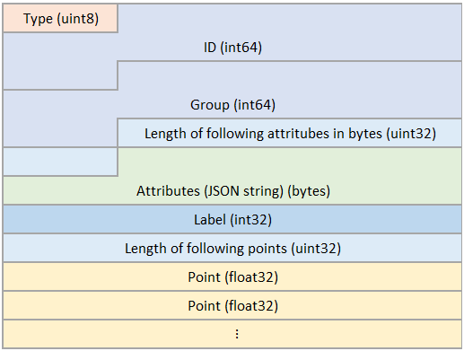

# Arrow

## Format specification

[Apache Arrow](https://arrow.apache.org/docs/format/Columnar.html) is a in-memory columnar table format specification with multiple language support.
This format supports to export into a single arrow file or multiple shardings.

### Table schema

|   id   | subset | media.type | media.path | media.bytes | media.attributes | annotations | attributes |
|:------:|:------:|:----------:|:----------:|:-----------:|:----------------:|:-----------:|:----------:|
| string | string |   uint32   |   string   |    binary   |      binary      |    binary   |   binary   |

### id (`string`)
The ID of each entity. A tuple of (`id`, `subset`) is a unique key of each entity.

### subset (`string`)
The subset the entity belongs to. A tuple of (`id`, `subset`) is a unique key of each entity.

### media.type (`uint32`)
The type of media the entity has.

**Supported media types:**

- 0: `None`
- 2: `Image`
- 6: `PointCloud`

### media.path (`string`)
The path of the media. It could be a real path or a relative path, or `/NOT/A/REAL/PATH` if path is invalid.

### media.bytes (`binary`)
The binary data of the media. It could be `None` if one chooses not to save media when export.

### media.attributes (`binary`)
The attribute of the entity. The contents of it depends on `media.type`.
The byte order is little-endian.

**Image**


**PointCloud**



### annotations (`binary`)
The annotations of the entity. The byte order is little-endian.
The annotations are more than one like following.



**Supported annotation types:**

- `Label`

  
- `Mask`

  
- `PolyLine`

  
- `Polygon`

  
- `Bbox`

  
- `Points`

  
- `Caption`

  
- `Cuboid3d`

  
- `Ellipse`

  

### attributes (`binary`)
The attributes of the entity. The byte order is little-endian.


## Import Arrow dataset

A Datumaro project with a Arrow source can be created in the following way:

```console
datum create
datum import --format arrow <path/to/dataset>
```

It is possible to specify project name and project directory. Run
`datum create --help` for more information.

An Arrow dataset directory should have the following structure:

<!--lint disable fenced-code-flag-->

```
└─ Dataset/
    ├── <subset_name_1>-0-of-2.arrow
    ├── <subset_name_1>-1-of-2.arrow
    ├── <subset_name_2>-0-of-1.arrow
    └── ...
```

If your dataset is not following the above directory structure,
it cannot detect and import your dataset as the Arrow format properly.

To make sure that the selected dataset has been added to the project, you can
run `datum project info`, which will display the project information.

## Export to other formats

It can convert Datumaro dataset into any other format [Datumaro supports](/docs/data-formats/supported_formats/).
To get the expected result, convert the dataset to formats
that support the specified task (e.g. for panoptic segmentation - VOC, CamVID)

There are several ways to convert a Datumaro dataset to other dataset formats
using CLI:

- Export a dataset from Datumaro format to VOC format:

```console
datum create
datum import -f arrow <path/to/dataset>
datum export -f voc -o <output/dir>
```

or

```console
datum convert -if arrow -i <path/to/dataset> -f voc -o <output/dir>
```

Or, using Python API:

```python
import datumaro as dm

dataset = dm.Dataset.import_from('<path/to/dataset>', 'arrow')
dataset.export('save_dir', 'voc', save_media=True, image_ext="AS-IS", num_workers=4)
```

## Export to Arrow

There are several ways to convert a dataset to Arrow format:

- Export a dataset from an existing project to Arrow format:
```console
# export dataset into Arrow format from existing project
datum export -p <path/to/project> -f arrow -o <output/dir> \
    -- --save-media
```

- Convert a dataset from VOC format to Arrow format:
```console
# converting to arrow format from other format
datum convert -if voc -i <path/to/dataset> \
    -f arrow -o <output/dir> -- --save-media
```

Extra options for exporting to Arrow format:
- `--save-media` allow to export dataset with saving media files.
  (default: `False`)
- `--image-ext IMAGE_EXT` allow to choose which scheme to use for image when `--save-media` is `True`.
  (default: `AS-IS`)

  Available options are (`AS-IS`, `PNG`, `TIFF`, `JPEG/95`, `JPEG/75`, `NONE`)
  - `AS-IS`: try to preserve original format. fall back to [PNG](https://en.wikipedia.org/wiki/PNG) if not found
  - `PNG`: [PNG](https://en.wikipedia.org/wiki/PNG)
  - `TIFF`: [TIFF](https://en.wikipedia.org/wiki/TIFF)
  - `JPEG/95`: [JPEG](https://en.wikipedia.org/wiki/JPEG) with 95 quality
  - `JPEG/75`: [JPEG](https://en.wikipedia.org/wiki/JPEG) with 75 quality
  - `NONE`: skip saving image.
- `--max-chunk-size MAX_CHUNK_SIZE` allow to specify maximum chunk size (batch size) when saving into arrow format.
  (default: `1000`)
- `--num-shards NUM_SHARDS` allow to specify the number of shards to generate.
  `--num-shards` and `--max-shard-size` are  mutually exclusive.
  (default: `1`)
- `--max-shard-size MAX_SHARD_SIZE` allow to specify maximum size of each shard. (e.g. 7KB = 7 \* 2^10, 3MB = 3 \* 2^20, and 2GB = 2 \* 2^30)
  `--num-shards` and `--max-shard-size` are  mutually exclusive.
  (default: `None`)
- `--num-workers NUM_WORKERS` allow to multi-processing for the export. If num_workers = 0, do not use multiprocessing (default: `0`).

## Examples

Examples of using this format from the code can be found in
[the format tests](https://github.com/openvinotoolkit/datumaro/blob/develop/tests/unit/data_formats/arrow/test_arrow_format.py)
