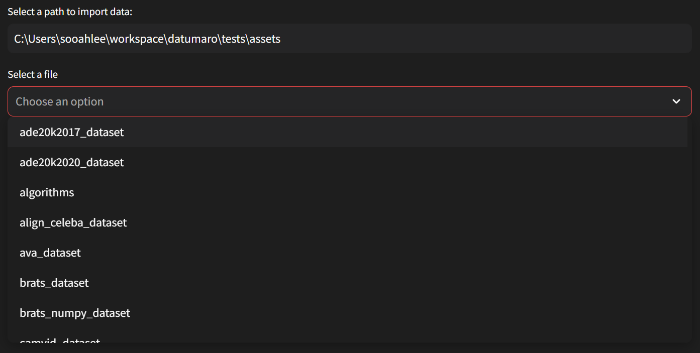

Usage
#####

There are several options available:

Standalone tool
---------------

Datuaro as a standalone tool allows to do various dataset operations from
the command line interface:

.. code-block::

    datum --help
    python -m datumaro --help

Python module
-------------

Datumaro can be used in custom scripts as a Python module. Used this way, it
allows to use its features from an existing codebase, enabling dataset
reading, exporting and iteration capabilities, simplifying integration of custom
formats and providing high performance operations:

.. code-block::

    import datumaro as dm

    dataset = dm.Dataset.import_from('path/', 'voc')

    # keep only annotated images
    dataset.select(lambda item: len(item.annotations) != 0)

    # change dataset labels and corresponding annotations
    dataset.transform('remap_labels',
        mapping={
          'cat': 'dog', # rename cat to dog
          'truck': 'car', # rename truck to car
          'person': '', # remove this label
        },
        default='delete') # remove everything else

    # iterate over the dataset elements
    for item in dataset:
        print(item.id, item.annotations)

    # export the resulting dataset in COCO format
    dataset.export('dst/dir', 'coco', save_images=True)

DatumaroApp module
-------------

Datumaro also provides a solution to users via GUI, which is DatumaroApp. This visually represents the features
necessary for performing complex tasks such as data processing, allowing users to easily
understand and interact with them, thereby enhancing user experience and enabling tasks to be
performed more intuitively. Additionally, it allows users with limited coding or programming
experience to use the solution. This enables users to immediately use the solution without the
need for separate development or setup processes, allowing them to start using the solution and
performing necessary tasks immediately.

.. code-block::

    cd gui
    python run.py

Following the above steps, the DatumaroApp page will appear.

.. image:: ../../../../images/gui/intro.png

Datumaro provides solutions not only for individual datasets but also for multiple datasets.
You can utilize these functionalities through the GUI. Simply select the desired dataset format
from the sidebar. Please click on **Single Dataset** on sidebar to proceed.

Enter the location where the desired dataset is located in the *Select a path to import data* field below, and then select
the dataset from among the options available.
Select the desired dataset from among those available in the *Select a file*. Whether your dataset is in a zip
file or a regular folder, both are importable.

.. image:: ../../../../images/gui/single_info.png

You can review information about the selected dataset below. You can view Dataset Information, Subset Info,
Category Info, and a sample of the dataset. For other functionalities, you can proceed through different tabs.

If you want to learn more about DatumaroApp in detail, please check `here <../../datumaroapp-reference/overview.rst>`_.
