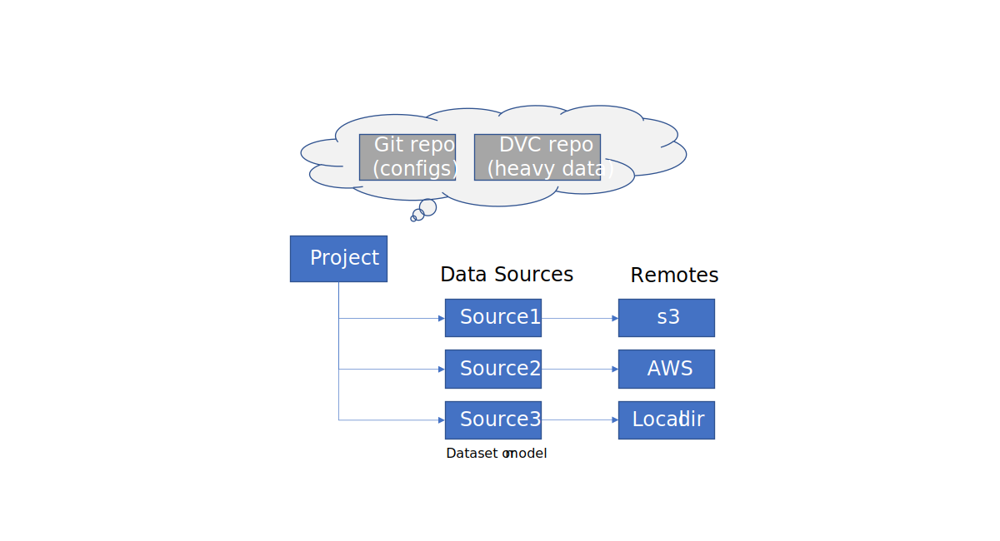

# User manual

## Contents

- [Installation](#installation)
  - [Plugins](#installation-plugins)
  - [Customizing installation](#customizing-installation)
- [How to use Datumaro](#how-to-use-datumaro)
  - [Glossary](#glossary)
  - [Command-line workflow](#command-line-workflow)
  - [Project data model](#data-model)
  - [Project layout](#project-layout)
  - [Examples](#cli-examples)
- [Supported dataset formats](#dataset-formats)
- [Supported annotation types](#annotation-types)
- [Supported media formats](#media-formats)
- [Command reference](#command-reference)
  - [Convert](#convert)
  - [Create](#create)
  - [Add](#source-add)
  - [Remove](#source-remove)
  - [Export](#export)
  - [Filter](#filter)
  - [Merge](#merge)
  - [Diff](#diff)
  - [Info](#info)
  - [Stats](#stats)
  - [Validate](#validate)
  - [Transform](#transform)
  - [Commit](#commit)
  - [Checkout](#checkout)
  - [Status](#status)
  - [Log](#log)
  - Models:
    - [Add](#model-add)
    - [Remove](#model-add)
    - [Run](#model-run)
  - [Run model inference explanation (explain)](#explain)
- [Extending](#extending)
  - [Builtin plugins](#builtin-plugins)
- [Links](#links)

## Installation

### Dependencies

- Python (3.6+)
- Optional: OpenVINO, TensorFlow, PyTorch, MxNet, Caffe, Accuracy Checker

### Installation steps

Optionally, set up a virtual environment:

``` bash
python -m pip install virtualenv
python -m virtualenv venv
. venv/bin/activate
```

Install:
``` bash
# From PyPI:
pip install datumaro[default]

# From the GitHub repository:
pip install 'git+https://github.com/openvinotoolkit/datumaro[default]'
```

Read more about choosing between `datumaro` and `datumaro[default]`
[here](#core-install).

#### Plugins <a id="installation-plugins"></a>

Datumaro has many plugins, which are responsible for dataset formats,
model launchers and other optional components. If a plugin has dependencies,
they can require additional installation. You can find the list of all the
plugin dependencies in the [plugins](#extending) section.

#### Customizing installation

- <a id="core-install"></a>In restricted installation environments,
  or if you need only basic Datumaro functionality, you can choose
  the installation option:
  - `pip install datumaro` - for core library functionality
  - `pip install datumaro[default]` - for normal CLI experience

- In some cases, there can be limited use for UI elements outside CLI,
  or limited options of installing graphical libraries in the system
  (various Docker environments, servers etc). You can select between using
  `opencv-python` and `opencv-python-headless` by setting the
  `DATUMARO_HEADLESS` environment variable to `0` or `1` before installing
  the package. It requires installation from sources (using `--no-binary`):
  ```bash
  DATUMARO_HEADLESS=1 pip install datumaro --no-binary=datumaro
  ```
  This option can't be covered by extras due to Python packaging system
  limitations.

- Although Datumaro excludes `pycocotools` of version 2.0.2 in
  requirements, it works with this version perfectly fine. The
  reason for such requirement is binary incompatibility of the `numpy`
  dependency in the `TensorFlow` and `pycocotools` binary packages,
  and the current workaround forces this package to be build from sources
  on most platforms
  (see [#253](https://github.com/openvinotoolkit/datumaro/issues/253)).
  If you need to use 2.0.2, make sure it is linked with the same version
  of `numpy` as `TensorFlow` by reinstalling the package:
  ``` bash
  pip uninstall pycocotools
  pip install pycocotools --no-binary=pycocotools
  ```

- When installing directly from the repository, you can change the
  installation branch with `...@<branch_name>`. Also use `--force-reinstall`
  parameter in this case. It can be useful for testing of unreleased
  versions from GitHub pull requests.

## How to use Datumaro

As a standalone tool or a Python module:

``` bash
datum --help

python -m datumaro --help
python datumaro/ --help
python datum.py --help
```

As a Python library:

``` python
from datumaro.components.project import Project
from datumaro.components.dataset import Dataset
from datumaro.components.extractor import Label, Bbox, DatasetItem
...
dataset = Dataset.import_from(path, format)
...
```

### Glossary

- Basic concepts:
  - dataset - A number of media (dataset items) and associated annotations
  - project - A combination of multiple datasets, plugins, models and metadata

- Project versioning concepts:
  - data source - a link to a dataset or a copy of a dataset inside a project.
    Basically, an URL + dataset format name
  - project revision - a commit hash or a named reference from
    Git (branch, tag, HEAD~3 etc.).
  - working / head / revision tree - a project build tree and plugins at
    a specified revision
  - data source revision - a data source hash at a specific stage
  - object - a tree or a data source revision data

- Dataset path concepts: <a id="revpath"></a>
  - source / dataset / revision / project path - a path to a dataset in a
    special format

    - (project local) **rev**ision **path**s - a way to specify the path
      to a source revision in the CLI, the syntax is:
      `<revision>:<source/target name>`, any part can be omitted.
      - Default revision is the working tree of the project
      - Default target is the compiled project

    - dataset revpath - a path to a dataset in the following format:
      `<dataset path>:<format>`
      - Format is optional. If not specified, will try to autodetect

    - full revpath - a path to a source revision in a project, the syntax is:
      `<project path>@<revision>:<target name>`, any part can be omitted.
      - Default project is the current project (`-p`/`--project` CLI arg.)
      - Default revision is the working tree of the project
      - Default target is the compiled project

- Dataset building concepts:
  - stage - a modification of a data source. A transformation,
    filter or something else.
  - build tree - a directed graph (tree) with leaf nodes at data sources
    and a single root node called "project"
  - build target - a data source or a stage
  - pipeline - a subgraph of a build target

- Other:
  - transform - a transformation operation over dataset elements. Examples are
    image renaming, filtering by a condition, image flipping,
    label remapping etc. Corresponds to the [transform command](#transform)

### Command-line workflow

In Datumaro, most command-line commands operate on projects, but there are
also few commands operating on datasets directly. There are 2 basic ways
to use Datumaro from the command-line:
- Use the [`convert`](#convert), [`diff`](#diff), [`merge`](#merge)
  commands directly on existing datasets

- Create a Datumaro project and operate on it:
  - Create an empty project with [`create`](#create)
  - Import existing datasets with [`add`](#source-add)
  - Modify the project with [`transform`](#transform) and [`filter`](#filter)
  - Create new revisions of the project with [commit](#commit), navigate over
    them using [checkout](#checkout), compare with [diff](#diff), compute
    statistics with [stats](#stats)
  - Export the resulting dataset with [`export`](#export)

Basically, a project is a combination of datasets, models and environment.

A project can contain an arbitrary number of data sources. Each data source
describes a dataset in a specific format. A project acts as a manager for
the data sources and allows to manipulate them separately or as a whole, in
which case it combines dataset items from all the sources into one composite
dataset. You can manage separate sources in a project by commands in
the `datum source` command-line context.

Note that **modifying operations** (`transform`, `filter`) **are applied
in-place** to the data sources by default.

If you want to interact with models, you need to add them to the project
first using the [`model add`](#model-add) command.

A typical way to obtain Datumaro projects is to export tasks in
[CVAT](https://github.com/openvinotoolkit/cvat) UI.

### Project data model <a id="data-model"></a>



Datumaro tries to combine a "Git for datasets" and a build system like
make or CMake for datasets in a single solution. Currently, `Project`
represents a Version Control System for datasets, which is based on Git and DVC
projects. Each project `Revision` describes a build tree of a dataset
with all the related metadata. A build tree consists of a number of data
sources and transformation stages. Each data source has its own set of build
steps (stages). Datumaro supposes copying of datasets and working in-place by
default. Modifying operations are recorded in the project, so any of the
dataset revisions can be reproduced when needed. Multiple dataset versions can
be stored in different branches with the common data shared.

Let's consider an example of a build tree:

There are 2 data sources in the example project. The resulting dataset
is obtained by simple merging (joining) the results of the input datasets.
"Source 1" and "Source 2" are the names of data sources in the project. Each
source has several stages with their own names. The first stage (called "root")
represents the original contents of a data source - the data at the
user-provided URL. The following stages represent operations, which needs to
be done with the data source to prepare the resulting dataset.

Roughly, such build tree can be created by the following commands (arguments
are omitted for simplicity):
``` bash
datum create

# describe the first source
datum add
datum filter
datum transform
datum transform

# describe the second source
datum add
datum model add
datum transform
datum transform

# now, the resulting dataset can be built with
datum export
```

### Project layout

``` bash
project/
├── .dvc/
├── .dvcignore
├── .git/
├── .gitignore
├── .datumaro/
│   ├── cache/ # object cache
│   │   ├── <2 leading symbols of obj hash>/
│   │   │   └── <rest symbols of obj hash>/
│   │   │       └── <object data>
│   ├── models/
│   ├── plugins/ # custom project-specific plugins
│   │   ├── plugin1/
│   │   |   ├── __init__.py
│   │   |   └── file2.py
│   │   ├── plugin2.py
│   │   └── ...
│   ├── tmp/ # temp files
│   └── tree/ # working tree metadata
│       ├── config.yml
│       └── sources/
│           ├── <source name 1>.dvc
│           ├── <source name 2>.dvc
│           └── ...
│
├── <source name 1>/
│   └── <source data>
└── <source name 2>/
    └── <source data>
```

### Use cases


Datumaro tries to restore a dataset from the project cache or reproduce it
from sources. It can be done as long as the source operations are recorded
and any step data is available.


### Examples <a id="cli-examples"></a>

Example: create a project, add dataset, modify, restore an old version

``` bash
datum create
datum add <path/to/coco/dataset> -f coco -n source1
datum commit -m "Added a dataset"
datum transform -t shapes_to_boxes
datum filter -e '/item/annotation[label="cat" or label="dog"]' -m i+a
datum commit -m "Transformed"
datum checkout HEAD~1 -- source1 # restore a previous revision
datum status # prints "modified source1"
datum checkout source1 # restore the last revision
datum export -f voc -- --save-images
```

## Supported Formats <a id="dataset-formats">

List of supported formats:
- MS COCO
  (`image_info`, `instances`, `person_keypoints`, `captions`, `labels`,`panoptic`, `stuff`)
  - [Format specification](http://cocodataset.org/#format-data)
  - [Dataset example](../tests/assets/coco_dataset)
  - `labels` are our extension - like `instances` with only `category_id`
  - [Format documentation](./formats/coco_user_manual.md)
- PASCAL VOC (`classification`, `detection`, `segmentation` (class, instances),
  `action_classification`, `person_layout`)
  - [Format specification](http://host.robots.ox.ac.uk/pascal/VOC/voc2012/htmldoc/index.html)
  - [Dataset example](../tests/assets/voc_dataset)
  - [Format documentation](./formats/pascal_voc_user_manual.md)
- YOLO (`bboxes`)
  - [Format specification](https://github.com/AlexeyAB/darknet#how-to-train-pascal-voc-data)
  - [Dataset example](../tests/assets/yolo_dataset)
  - [Format documentation](./formats/yolo_user_manual.md)
- TF Detection API (`bboxes`, `masks`)
  - Format specifications: [bboxes](https://github.com/tensorflow/models/blob/master/research/object_detection/g3doc/using_your_own_dataset.md),
    [masks](https://github.com/tensorflow/models/blob/master/research/object_detection/g3doc/instance_segmentation.md)
  - [Dataset example](../tests/assets/tf_detection_api_dataset)
- WIDER Face (`bboxes`)
  - [Format specification](http://shuoyang1213.me/WIDERFACE/)
  - [Dataset example](../tests/assets/wider_dataset)
- VGGFace2 (`landmarks`, `bboxes`)
  - [Format specification](https://github.com/ox-vgg/vgg_face2)
  - [Dataset example](../tests/assets/vgg_face2_dataset)
- MOT sequences
  - [Format specification](https://arxiv.org/pdf/1906.04567.pdf)
  - [Dataset example](../tests/assets/mot_dataset)
- MOTS (png)
  - [Format specification](https://www.vision.rwth-aachen.de/page/mots)
  - [Dataset example](../tests/assets/mots_dataset)
- ImageNet (`classification`, `detection`)
  - [Dataset example](../tests/assets/imagenet_dataset)
  - [Dataset example (txt for classification)](../tests/assets/imagenet_txt_dataset)
  - Detection format is the same as in PASCAL VOC
- CIFAR-10/100 (`classification` (python version))
  - [Format specification](https://www.cs.toronto.edu/~kriz/cifar.html)
  - [Dataset example](../tests/assets/cifar_dataset)
  - [Format documentation](./formats/cifar_user_manual.md)
- MNIST (`classification`)
  - [Format specification](http://yann.lecun.com/exdb/mnist/)
  - [Dataset example](../tests/assets/mnist_dataset)
  - [Format documentation](./formats/mnist_user_manual.md)
- MNIST in CSV (`classification`)
  - [Format specification](https://pjreddie.com/projects/mnist-in-csv/)
  - [Dataset example](../tests/assets/mnist_csv_dataset)
  - [Format documentation](./formats/mnist_user_manual.md)
- CamVid (`segmentation`)
  - [Format specification](http://mi.eng.cam.ac.uk/research/projects/VideoRec/CamVid/)
  - [Dataset example](../tests/assets/camvid_dataset)
- Cityscapes (`segmentation`)
  - [Format specification](https://www.cityscapes-dataset.com/dataset-overview/)
  - [Dataset example](../tests/assets/cityscapes_dataset)
  - [Format documentation](./formats/cityscapes_user_manual.md)
- KITTI (`segmentation`, `detection`)
  - [Format specification](http://www.cvlibs.net/datasets/kitti/index.php)
  - [Dataset example](../tests/assets/kitti_dataset)
  - [Format documentation](./formats/kitti_user_manual.md)
- KITTI 3D (`raw`/`tracklets`/`velodyne points`)
  - [Format specification](http://www.cvlibs.net/datasets/kitti/raw_data.php)
  - [Dataset example](../tests/assets/kitti_dataset/kitti_raw)
  - [Format documentation](./formats/kitti_raw_user_manual.md)
- Supervisely (`pointcloud`)
  - [Format specification](https://docs.supervise.ly/data-organization/00_ann_format_navi)
  - [Dataset example](../tests/assets/sly_pointcloud)
  - [Format documentation](./formats/sly_pointcloud_user_manual.md)
- CVAT
  - [Format specification](https://github.com/opencv/cvat/blob/develop/cvat/apps/documentation/xml_format.md)
  - [Dataset example](../tests/assets/cvat_dataset)
- LabelMe
  - [Format specification](http://labelme.csail.mit.edu/Release3.0)
  - [Dataset example](../tests/assets/labelme_dataset)
- ICDAR13/15 (`word_recognition`, `text_localization`, `text_segmentation`)
  - [Format specification](https://rrc.cvc.uab.es/?ch=2)
  - [Dataset example](../tests/assets/icdar_dataset)
- Market-1501 (`person re-identification`)
  - [Format specification](https://www.aitribune.com/dataset/2018051063)
  - [Dataset example](../tests/assets/market1501_dataset)
- LFW (`classification`, `person re-identification`, `landmarks`)
  - [Format specification](http://vis-www.cs.umass.edu/lfw/)
  - [Dataset example](../tests/assets/lfw_dataset)

### Supported annotation types <a id="annotation-types"></a>

- Labels
- Bounding boxes
- Polygons
- Polylines
- (Segmentation) Masks
- (Key-)Points
- Captions
- 3D cuboids

Datumaro does not separate datasets by tasks like classification, detection
etc. Instead, datasets can have any annotations. When a dataset is exported
in a specific format, only relevant annotations are exported.

## Media formats

Datumaro supports the following media types:
- 2D RGB(A) images
- KITTI Point Clouds

To create an unlabelled dataset from an arbitrary directory with images use
`image_dir` and `image_zip` formats:

``` bash
datum create -o <project/dir>
datum add -p <project/dir> -f image_dir <directory/path/>
```

or, if you work with Datumaro API:

- for using with a project:

  ```python
  from datumaro.components.project import Project

  project = Project.init()
  project.import_source('source1', format='image_dir', url='directory/path/')
  dataset = project.working_tree.make_dataset()
  ```

- for using as a dataset:

  ```python
  from datumaro.components.dataset import Dataset

  dataset = Dataset.import_from('directory/path/', 'image_dir')
  ```

This will search for images in the directory recursively and add
them as dataset entries with names like `<subdir1>/<subsubdir1>/<image_name1>`.
The list of formats matches the list of supported image formats in OpenCV:
```
.jpg, .jpeg, .jpe, .jp2, .png, .bmp, .dib, .tif, .tiff, .tga, .webp, .pfm,
.sr, .ras, .exr, .hdr, .pic, .pbm, .pgm, .ppm, .pxm, .pnm
```

Once there is a `Dataset` instance, it's items can be split into subsets,
renamed, filtered, joined with annotations, exported in various formats etc.

To use a video as an input, one should either create a [plugin](#extending),
which splits a video into frames, or split the video manually and import images.

## Command reference


> **Note**: command invocation syntax is subject of change,
> **always refer to the `--help` output of the specific command**

Datumaro functionality is available with the `datum` command.

Usage:
``` bash
datum [-h] [--version] [--loglevel LOGLEVEL] [command] [command args]
```

Parameters:
- `--loglevel` (string) - Logging level, one of
  `debug`, `info`, `warning`, `error`, `critical` (default: `info`)
- `--version` Print the version number and exit.
- `-h, --help` - Print the help message and exit.

### Convert datasets <a id="convert"></a>

This command allows to convert a dataset from one format to another.
The command is a usability alias for [`create`](#create),
[`add`](#source-add) and [`export`](#export) and just provides a simpler
way to obtain the same results in simple cases. A list of supported
formats can be found in the `--help` output of this command.

Usage:

``` bash
datum convert [-h] [-i SOURCE] [-if INPUT_FORMAT] -f OUTPUT_FORMAT
  [-o DST_DIR] [--overwrite] [-e FILTER] [--filter-mode FILTER_MODE]
  [-- EXTRA_EXPORT_ARGS]
```

Parameters:
- `-i, --input-path` (string) - Input dataset path. The current directory is
  used by default.
- `-if, --input-format` (string) - Input dataset format. Will try to detect,
  if not specified.
- `-f, --output-format` (string) - Output format
- `-o, --output-dir` (string) - Output directory. By default, a subdirectory
  in the current directory is used.
- `--overwrite` - Allows overwriting existing files in the output directory,
  when it is not empty.
- `-e, --filter` (string) - XML XPath filter expression for dataset items
- `--filter-mode` (string) - The filtering mode. Default is the `i` mode.
- `-p, --project` (string) - Directory of the project to operate on
  (default: current directory).
- `-h, --help` - Print the help message and exit.
- `-- <extra export args>` - Additional arguments for the format writer
  (use `-- -h` for help). Must be specified after the main command arguments.

Example: convert a VOC-like dataset to a COCO-like one:

``` bash
datum convert --input-format voc --input-path <path/to/voc/> \
              --output-format coco \
              -- --save-images
```

### Create project <a id="create"></a>

The command creates an empty project. A project is required for the most of
Datumaro functionality.

By default, the project is created in the current directory. To specify
another output directory, pass the `-o/--output-dir` parameter. If output
already directory contains a Datumaro project, an error is raised, unless
`--overwrite` is used.

Usage:

``` bash
datum create [-h] [-o DST_DIR] [--overwrite]
```

Parameters:
- `-o, --output-dir` (string) - Allows to specify an output directory.
  The current directory is used by default.
- `--overwrite` - Allows to overwrite existing project files in the output
  directory. Any other files are not touched.
- `-h, --help` - Print the help message and exit.

Examples:

Example: create an empty project in the `my_dataset` directory

``` bash
datum create -o my_dataset/
```

Example: create a new empty project in the current directory, remove the
existing one

``` bash
datum create
...
datum create --overwrite
```

### Import datasets <a id="source-add"></a>

A project can contain an arbitrary number of Data Sources. Each Data Source
describes a dataset in a specific format. A project acts as a manager for
the data sources and allows to manipulate them separately or as a whole, in
which case it combines dataset items from all the sources into one composite
dataset. You can manage separate sources in a project by commands in
the `datum source` command line context.

Existing datasets can be added to a Datumaro project with the `add` command.

Datasets come in a wide variety of formats. Each dataset
format defines its own data structure and rules on how to
interpret the data. For example, the following data structure
is used in COCO format:
<!--lint disable fenced-code-flag-->
```
/dataset/
- /images/<id>.jpg
- /annotations/
```
<!--lint enable fenced-code-flag-->

Dataset format readers can provide some additional import options. To pass
such options, use the `--` separator after the main command arguments.
The usage information can be printed with `datum add -f <format> -- --help`.

Check [supported formats](#dataset-formats) for more info about
format specifications, supported options and other details.
The list of formats can be extended by custom plugins, check [extending tips](#extending)
for information on this topic.

The list of currently available formats are listed in the command help output.

Datumaro supports working with complete datasets, having both image data and
annotations, or with annotations only. It can be used to prepare
images and annotations independently of each other, or to process the
lightweight annotations without downloading the whole dataset.

A dataset is imported by its URL. Currently, only local filesystem
paths are supported. The URL can be a file or a directory path
to a dataset. When the dataset is read, it is read as a whole.
However, many formats can have multiple subsets like `train`, `val`, `test`
etc. If you want to limit reading only to a specific subset, use
the `-r/--path` parameter. It can also be useful when subset files have
non-standard placement or names.

When a dataset is imported, the following things are done:
- URL is saved in the project config
- data in copied into the project
- data is cached inside the project (use `--no-cache` to disable)

Each data source has a name assigned, which can be used in other commands. To
set a specific name, use the `-n/--name` parameter.

The dataset is added into the working tree of the project. A new commit
is _not_ done automatically.

Usage:

``` bash
datum add [-h] [-n NAME] -f FORMAT [-r PATH] [--no-check] [--no-cache]
  [-p PROJECT_DIR] url [-- EXTRA_FORMAT_ARGS]
```

Parameters:
- `<url>` (string) - A file of directory path to the dataset.
- `-f, --format` (string) - Dataset format
- `-r, --path` (string) - A path relative to the source URL the data source.
  Useful to specify a path to a subset, subtask, or a specific file in URL.
- `--no-check` - Don't try to read the source after importing
- `--no-cache` - Don't put a copy into the project cache
- `-n`, `--name` (string) - Name of the new source (default: generate
  automatically)
- `-p, --project` (string) - Directory of the project to operate on
  (default: current directory).
- `-h, --help` - Print the help message and exit.
- `-- <extra format args>` - Additional arguments for the format reader
  (use `-- -h` for help). Must be specified after the main command arguments.

Example: create a project from images and annotations in different formats,
export as TFrecord for TF Detection API for model training

``` bash
datum create
# 'default' is the name of the subset below
datum add <path/to/coco/instances_default.json> -f coco_instances
datum add <path/to/cvat/default.xml> -f cvat
datum add <path/to/voc> -f voc_detection -r custom_subset_dir/default.txt
datum add <path/to/datumaro/default.json> -f datumaro
datum add <path/to/images/dir> -f image_dir
datum export -f tf_detection_api -- --save-images
```

### Remove datasets <a id="source-remove"></a>

To remove a data source from a project, use the `remove` command.

Usage:

``` bash
datum remove [-h] [--force] [--keep-data] [-p PROJECT_DIR] name [name ...]
```

Parameters:
- `<name>` (string) - The name of the source to be removed (repeatable)
- `-f, --force` - Do not fail and stop on errors during removal
- `--keep-data` - Do not remove source data from the working directory, remove
  only project metainfo.
- `-p, --project` (string) - Directory of the project to operate on
  (default: current directory).
- `-h, --help` - Print the help message and exit.

Example:

``` bash
datum create
datum add path/to/dataset/ -f voc -n src1
datum remove src1
```

### Export datasets <a id="export"></a>

This command exports a project or a source as a dataset in some format.

Check [supported formats](#dataset-formats) for more info about
format specifications, supported options and other details.
The list of formats can be extended by custom plugins, check [extending tips](#extending)
for information on this topic.

Available formats are listed in the command help output.

Dataset format writers support additional export options. To pass
such options, use the `--` separator after the main command arguments.
The usage information can be printed with `datum add -f <format> -- --help`.

Common export options:
- Most formats (where applicable) support the `--save-images` option, which
  allows to export dataset images along with annotations. The option is
  disabled be default.
- If `--save-images` is used, the `image-ext` option can be passed to
  specify the output image file extension (`.jpg`, `.png` etc.). By default,
  tries to Datumaro keep the original image extension. This option
  allows to convert all the images from one format into another.

This command allows to use the `-f/--filter` parameter to select dataset
elements needed for exporting. Read the [`filter`](#filter) command
description for more info about this functionality.

The command can only be applied to a project build target, a stage
or the combined 'project' target, in which case all the targets will
be affected.

Usage:

``` bash
datum export [-h] [-e FILTER] [--filter-mode FILTER_MODE] [-o DST_DIR]
  [--overwrite] [-p PROJECT_DIR] -f FORMAT [target] [-- EXTRA_FORMAT_ARGS]
```

Parameters:
- `<target>` (string) - A project build target to be exported.
  By default, all project targets are affected.
- `-f, --format` (string) - Output format.
- `-e, --filter` (string) - XML XPath filter expression for dataset items
- `--filter-mode` (string) - The filtering mode. Default is the `i` mode.
- `-o, --output-dir` (string) - Output directory. By default, a subdirectory
  in the current directory is used.
- `--overwrite` - Allows overwriting existing files in the output directory,
  when it is not empty.
- `-p, --project` (string) - Directory of the project to operate on
  (default: current directory).
- `-h, --help` - Print the help message and exit.
- `-- <extra format args>` - Additional arguments for the format writer
  (use `-- -h` for help). Must be specified after the main command arguments.

Example: save a project as a VOC-like dataset, include images, convert
images to `PNG` from other formats.

``` bash
datum export \
  -p test_project \
  -o test_project-export \
  -f voc \
  -- --save-images --image-ext='.png'
```

### Filter datasets <a id="filter"></a>

This command allows to extract a sub-dataset from a dataset. The new dataset
includes only items satisfying some condition. The XML [XPath](https://devhints.io/xpath)
is used as a query format.

There are several filtering modes available (the `-m/--mode` parameter).
Supported modes:
- `i`, `items`
- `a`, `annotations`
- `i+a`, `a+i`, `items+annotations`, `annotations+items`

When filtering annotations, use the `items+annotations`
mode to point that annotation-less dataset items should be
removed, otherwise they will be kept in the resulting dataset.
To select an annotation, write an XPath that returns `annotation`
elements (see examples).

Item representations can be printed with the `--dry-run` parameter:

``` xml
<item>
  <id>290768</id>
  <subset>minival2014</subset>
  <image>
    <width>612</width>
    <height>612</height>
    <depth>3</depth>
  </image>
  <annotation>
    <id>80154</id>
    <type>bbox</type>
    <label_id>39</label_id>
    <x>264.59</x>
    <y>150.25</y>
    <w>11.19</w>
    <h>42.31</h>
    <area>473.87</area>
  </annotation>
  <annotation>
    <id>669839</id>
    <type>bbox</type>
    <label_id>41</label_id>
    <x>163.58</x>
    <y>191.75</y>
    <w>76.98</w>
    <h>73.63</h>
    <area>5668.77</area>
  </annotation>
  ...
</item>
```

The command can only be applied to a project build target, a stage or the
combined `project` target, in which case all the targets will be affected.
A build tree stage will be added if `--stage` is enabled, and the resulting
dataset(-s) will be saved if `--apply` is enabled.

Usage:

``` bash
datum filter [-h] [-e FILTER] [-m MODE] [--dry-run] [--stage STAGE]
  [--apply APPLY] [-o DST_DIR] [--overwrite] [-p PROJECT_DIR] [target]
```

Parameters:
- `<target>` (string) - A project build target to be filtered.
  By default, all project targets are affected.
- `-e, --filter` (string) - XML XPath filter expression for dataset items
- `-m, --mode` (string) - The filtering mode. Default is the `i` mode.
- `--dry-run` - Print XML representations of the filtered dataset and exit.
- `--stage` (bool) - Include this action as a project build step.
  If true, this operation will be saved in the project
  build tree, allowing to reproduce the resulting dataset later.
  Applicable only to data source targets (i.e. not intermediate stages)
  and the `project` target. Enabled by default.
- `--apply` (bool) - Run this command immediately. If disabled, only the
  build tree stage will be written. Enabled by default.
- `-o, --output-dir` (string) - Output directory. Can be omitted for
  data source targets (i.e. not intermediate stages) and the `project` target,
  in which case the results will be saved inplace in the working tree.
- `--overwrite` - Allows to overwrite existing files in the output directory,
  when it is specified and is not empty.
- `-p, --project` (string) - Directory of the project to operate on
  (default: current directory).
- `-h, --help` - Print the help message and exit.

Example: extract a dataset with images with `width` < `height`

``` bash
datum filter \
  -p test_project \
  -e '/item[image/width < image/height]'
```

Example: extract a dataset with images of the `train` subset

``` bash
datum filter \
  -p test_project \
  -e '/item[subset="train"]'
```

Example: extract a dataset with only large annotations of the `cat` class and
any non-`persons`

``` bash
datum filter \
  -p test_project \
  --mode annotations \
  -e '/item/annotation[(label="cat" and area > 99.5) or label!="person"]'
```

Example: extract a dataset with non-occluded annotations, remove empty images.
Use data only from the "s1" source of the project.

``` bash
datum create
datum add path/to/dataset1/ --format voc --name s1
datum add path/to/dataset2/ --format voc --name s2
datum filter s1 \
  -m i+a -e '/item/annotation[occluded="False"]'
```

### Transform dataset <a id="transform"></a>

Often datasets need to be modified during preparation for model training and
experimenting. In trivial cases it can be done manually - e.g. image renaming
or label renaming. However, in more complex cases even simple modifications
can require too much efforts, distracting the user from the real work.
Datumaro provides the `datum transform` command to help in such cases.

This command allows to modify dataset images or annotations all at once.

> This command is designed for batch dataset processing, so if you only
> need to modify few elements of a dataset, you might want to use
> other approaches for better performance. A possible solution can be
> a simple script, which uses [Datumaro API](./developer_guide.md).

The command can only be applied to a project build target, a stage
or the combined `project` target, in which case all the targets will
be affected. A build tree stage will be added if `--stage` is enabled,
and the resulting dataset(-s) will be saved if `--apply` is enabled.

Usage:

``` bash
datum transform [-h] -t TRANSFORM [-o DST_DIR] [--overwrite]
  [-p PROJECT_DIR] [--stage STAGE] [--apply APPLY] [target] [-- EXTRA_ARGS]
```

Parameters:
- `<target>` (string) - A project build target to be transformed.
  By default, all project targets are affected.
- `-t, --transform` (string) - Transform method name
- `--stage` (bool) - Include this action as a project build step.
  If true, this operation will be saved in the project
  build tree, allowing to reproduce the resulting dataset later.
  Applicable only to data source targets (i.e. not intermediate stages)
  and the `project` target. Enabled by default.
- `--apply` (bool) - Run this command immediately. If disabled, only the
  build tree stage will be written. Enabled by default.
- `-o, --output-dir` (string) - Output directory. Can be omitted for
  data source targets (i.e. not intermediate stages) and the `project` target,
  in which case the results will be saved inplace in the working tree.
- `--overwrite` - Allows to overwrite existing files in the output directory,
  when it is specified and is not empty.
- `-p, --project` (string) - Directory of the project to operate on
  (default: current directory).
- `-h, --help` - Print the help message and exit.
- `<extra args>` - The list of extra transformation parameters. Should be
  passed after the `--` separator after the main command arguments. See
  transform descriptions for info about extra parameters. Use the `--help`
  option to print parameter info.

#### Built-in transforms <a id="builtin-transforms"></a>

Basic dataset item manipulations:
- `rename` - Renames dataset items by regular expression
- `id_from_image_name` - Renames dataset items to their image filenames
- `reindex` - Renames dataset items with numbers
- `ndr` - Removes duplicated images from dataset
- `sampler` - Runs inference and leaves only the most representative images

Subset manipulations:
- `random_split` - Splits dataset into subsets randomly
- `split` - Splits dataset into subsets for classification, detection,
  segmentation or re-identification
- `map_subsets` - Renames and removes subsets

Annotation manipulations:
- `remap_labels` - Renames, adds or removes labels in dataset
- `shapes_to_boxes` - Replaces spatial annotations with bounding boxes
- `boxes_to_masks` - Converts bounding boxes to instance masks
- `polygons_to_masks` - Converts polygons to instance masks
- `masks_to_polygons` - Converts instance masks to polygons
- `anns_to_labels` - Replaces annotations having labels with label annotations
- `merge_instance_segments` - Merges grouped spatial annotations into a mask
- `crop_covered_segments` - Removes occluded segments of covered masks
- `bbox_value_decrement` - Subtracts 1 from bbox coordinates

Examples:

- Split a dataset randomly to `train` and `test` subsets, ratio is 2:1
``` bash
datum transform -t random_split -- --subset train:.67 --subset test:.33
```

- Split a dataset for a specific task. The tasks supported are
classification, detection, segmentation and re-identification.

``` bash
datum transform -t split -- \
  -t classification --subset train:.5 --subset val:.2 --subset test:.3

datum transform -t split -- \
  -t detection --subset train:.5 --subset val:.2 --subset test:.3

datum transform -t split -- \
  -t segmentation --subset train:.5 --subset val:.2 --subset test:.3

datum transform -t split -- \
  -t reid --subset train:.5 --subset val:.2 --subset test:.3 \
  --query .5
```

- Convert spatial annotations between each other

``` bash
datum transform -t boxes_to_masks
datum transform -t masks_to_polygons
datum transform -t polygons_to_masks
datum transform -t shapes_to_boxes
```

- Remap dataset labels, `person` to `car` and `cat` to `dog`,
keep `bus`, remove others

``` bash
datum transform -t remap_labels -- \
  -l person:car -l bus:bus -l cat:dog \
  --default delete
```

- Rename dataset items by a regular expression
  - Replace `pattern` with `replacement`
  - Remove `frame_` from item ids

``` bash
datum transform -t rename -- -e '|pattern|replacement|'
datum transform -t rename -- -e '|frame_(\d+)|\\1|'
```

- Create a dataset from K the most hard items for a model. The dataset will
be split into the `sampled` and `unsampled` subsets, based on the model
confidence, which is stored in the `scores` annotation attribute.

There are five methods of sampling (the `-m/--method` option):
- `topk` - Return the k with high uncertainty data
- `lowk` - Return the k with low uncertainty data
- `randk` - Return the random k data
- `mixk` - Return half to topk method and the rest to lowk method
- `randtopk` - First, select 3 times the number of k randomly, and return
  the topk among them.

``` bash
datum transform -t sampler -- \
  -a entropy \
  -i train \
  -o sampled \
  -u unsampled \
  -m topk \
  -k 20
```

- Remove duplicated images from a dataset. Keep at most N resulting images.
  - Available sampling options (the `-e` parameter):
    - `random` - sample from removed data randomly
    - `similarity` - sample from removed data with ascending
  - Available sampling methods (the `-u` parameter):
    - `uniform` - sample data with uniform distribution
    - `inverse` - sample data with reciprocal of the number

``` bash
datum transform -t ndr -- \
  -w train \
  -a gradient \
  -k 100 \
  -e random \
  -u uniform
```

### Merge datasets <a id="merge"></a>

Consider the following task: there is a set of images (the original dataset)
we want to annotate. Suppose we did this manually and/or automated it
using models, and now we have few sets of annotations for the same images.
We want to merge them and produce a single set of high-precision annotations.

Another use case: there are few datasets with different sets of images
and labels, which we need to combine in a single dataset. If the labels
were the same, we could just join the datasets. But in this case we need
to merge labels and adjust the annotations in the resulting dataset.

In Datumaro, it can be done with the `merge` command. This command merges 2
or more datasets and checks annotations for errors.

Datasets are merged by items, and item annotations are merged by finding the
unique ones across datasets. Annotations are matched between matching dataset
items by distance. Spatial annotations are compared by the applicable distance
measure (IoU, OKS, PDJ etc.), labels and annotation attributes are selected
by voting. Each set of matching annotations produces a single annotation in
the resulting dataset. The `score` (a number in the range \[0; 1\]) attribute
indicates the agreement between different sources in the produced annotation.
The working time of the function can be estimated as
`O( (summary dataset length) * (dataset count) ^ 2 * (item annotations) ^ 2 )`

This command also allows to merge datasets with different, or partially
overlapping sets of labels (which is impossible by simple joining).

During the process, some merge conflicts can appear. For example,
it can be mismatching dataset images having the same ids, label voting
can be unsuccessful if quorum is not reached (the `--quorum` parameter),
bboxes may be too close (the `-iou` parameter) etc. Found merge
conflicts, missing items or annotations, and other errors are saved into
an output `.json` file.

In Datumaro, annotations can be grouped. It can be useful to represent
different parts of a single object - for example, it can be different parts
of a human body, parts of a vehicle etc. This command allows to check
annotation groups for completeness with the `-g/--groups` option. If used,
this parameter must specify a list of labels for annotations that must be
in the same group. It can be particularly useful to check if separate
keypoints are grouped and all the necessary object components in the same
group.

This command has multiple forms:
``` bash
1) datum merge <revpath>
2) datum merge <revpath> <revpath> ...
```

\<revpath\> - either [a dataset path or a revision path](#revpath).

1 - Merges the current project's main target ("project")
  in the working tree with the specified dataset.

2 - Merges the specified datasets.
  Note that the current project is not included in the list of merged
  sources automatically.

Usage:
``` bash
datum merge [-h] [-iou IOU_THRESH] [-oconf OUTPUT_CONF_THRESH]
  [--quorum QUORUM] [-g GROUPS] [-o DST_DIR] [--overwrite]
  [-p PROJECT_DIR]
  target [target ...]
```

Parameters:
- `<target>` (string) - Target [dataset revpaths](#revpath) (repeatable)
- `-iou`, `--iou-thresh` (number) - IoU matching threshold for spatial
  annotations (both maximum inter-cluster and pairwise). Default is 0.25.
- `--quorum` (number) - Minimum count of votes for a label or attribute
  to be counted. Default is 0.
- `-g, --groups` (string) - A comma-separated list of label names in
  annotation groups to check. The `?` postfix can be added to a label to
  make it optional in the group (repeatable)
- `-oconf`, `--output-conf-thresh` (number) - Confidence threshold for output
  annotations to be included in the resulting dataset. Default is 0.
- `-o, --output-dir` (string) - Output directory. By default, a new directory
  is created in the current directory.
- `--overwrite` - Allows to overwrite existing files in the output directory,
  when it is specified and is not empty.
- `-p, --project` (string) - Directory of the project to operate on
  (default: current directory).
- `-h, --help` - Print the help message and exit.


Examples:

Merge 4 (partially-)intersecting projects,
- consider voting successful when there are no less than 3 same votes
- consider shapes intersecting when IoU >= 0.6
- check annotation groups to have `person`, `hand`, `head` and `foot`
(`?` is used for optional parts)

``` bash
datum merge project1/ project2/ project3/ project4/ \
  --quorum 3 \
  -iou 0.6 \
  --groups 'person,hand?,head,foot?'
```

Merge images and annotations from 2 datasets in COCO format:
`datum merge dataset1/:image_dir dataset2/:coco dataset3/:coco`

Check groups of the merged dataset for consistency:
  look for groups consisting of `person`, `hand` `head`, `foot`
`datum merge project1/ project2/ -g 'person,hand?,head,foot?'`

Merge two datasets, specify formats:
`datum merge path/to/dataset1:voc path/to/dataset2:coco`

Merge the current working tree and a dataset:
`datum merge path/to/dataset2:coco`

Merge a source from a previous revision and a dataset:
`datum merge HEAD~2:source-2 path/to/dataset2:yolo`

### Compare datasets <a id="diff"></a>

The command compares two datasets and saves the results in the
specified directory. The current project is considered to be
"ground truth".

Datasets can be compared using different methods:
- `equality` - Annotations are compared to be equal
- `distance` - A distance metric is used

This command has multiple forms:
``` bash
1) datum diff <revpath>
2) datum diff <revpath> <revpath>
```

1 - Compares the current project's main target (`project`)
  in the working tree with the specified dataset.

2 - Compares two specified datasets.

\<revpath\> - [a dataset path or a revision path](#revpath).

Usage:
``` bash
datum diff [-h] [-o DST_DIR] [-m METHOD] [--overwrite] [-p PROJECT_DIR]
  [--iou-thresh IOU_THRESH] [-f FORMAT]
  [-iia IGNORE_ITEM_ATTR] [-ia IGNORE_ATTR] [-if IGNORE_FIELD]
  [--match-images] [--all]
  first_target [second_target]
```

Parameters:
- `<target>` (string) - Target [dataset revpaths](#revpath)
- `-m, --method` (string) - Comparison method.
- `-o, --output-dir` (string) - Output directory. By default, a new directory
  is created in the current directory.
- `--overwrite` - Allows to overwrite existing files in the output directory,
  when it is specified and is not empty.
- `-p, --project` (string) - Directory of the project to operate on
  (default: current directory).
- `-h, --help` - Print the help message and exit.

- Distance comparison options:
  - `--iou-thresh` (number) - The IoU threshold for spatial annotations
    (default is 0.5).
  - `-f, --format` (string) - Output format, one of `simple`
    (text files and images) and `tensorboard` (a TB log directory)

- Equality comparison options:
  - `-iia, --ignore-item-attr` (string) - Ignore an item attribute (repeatable)
  - `-ia, --ignore-attr` (string) - Ignore an annotation attribute (repeatable)
  - `-if, --ignore-field` (string) - Ignore an annotation field (repeatable)
    Default is `id` and `group`
  - `--match-images` - Match dataset items by image pixels instead of ids
  - `--all` - Include matches in the output. By default, only differences are
    printed.


Examples:
- Compare two projects by distance, match boxes if IoU > 0.7,
  save results to TensorBoard:
`datum diff other/project -o diff/ -f tensorboard --iou-thresh 0.7`

- Compare two projects for equality, exclude annotation groups
  and the `is_crowd` attribute from comparison:
`datum diff other/project/ -if group -ia is_crowd`

- Compare two datasets, specify formats:
`datum diff path/to/dataset1:voc path/to/dataset2:coco`

- Compare the current working tree and a dataset:
`datum diff path/to/dataset2:coco`

- Compare a source from a previous revision and a dataset:
`datum diff HEAD~2:source-2 path/to/dataset2:yolo`

- Compare a dataset with model inference
``` bash
datum import <...>
datum model add mymodel <...>
datum transform <...> -o inference
datum diff inference -o diff
```

### Get project info <a id="info"></a>

This command outputs project status information, lists of data sources,
plugins and models.

Usage:

``` bash
datum info [-h] [--all] [-p PROJECT_DIR] [target]
```

Parameters:
- `<target>` (string) - Target [source revpaths](#revpath). By default,
  prints information about all the sources and the merged dataset.
- `--all` - Print all the information: do not fold long lists of labels etc.
- `-p, --project` (string) - Directory of the project to operate on
  (default: current directory).
- `-h, --help` - Print the help message and exit.


Example:

``` bash
datum info -p /test_project

Project:
  name: test_project
  location: /test_project
Sources:
  source 'instances_minival2014':
    format: coco_instances
    url: /coco_like/annotations/instances_minival2014.json
Dataset:
  length: 5000
  categories: label
    label:
      count: 80
      labels: person, bicycle, car, motorcycle (and 76 more)
  subsets: minival2014
    subset 'minival2014':
      length: 5000
      categories: label
        label:
          count: 80
          labels: person, bicycle, car, motorcycle (and 76 more)
```

### Get project statistics <a id="stats"></a>

This command computes various project statistics, such as:
- image mean and std. dev.
- class and attribute balance
- mask pixel balance
- segment area distribution

Usage:

``` bash
datum stats [-h] [-p PROJECT_DIR] [target]
```

Parameters:
- `<target>` (string) - Target [source revpath](#revpath). By default,
  computes statistics of the merged dataset.
- `-p, --project` (string) - Directory of the project to operate on
  (default: current directory).
- `-h, --help` - Print the help message and exit.

Example:

<details>

``` bash
datum stats -p test_project

{
    "annotations": {
        "labels": {
            "attributes": {
                "gender": {
                    "count": 358,
                    "distribution": {
                        "female": [
                            149,
                            0.41620111731843573
                        ],
                        "male": [
                            209,
                            0.5837988826815642
                        ]
                    },
                    "values count": 2,
                    "values present": [
                        "female",
                        "male"
                    ]
                },
                "view": {
                    "count": 340,
                    "distribution": {
                        "__undefined__": [
                            4,
                            0.011764705882352941
                        ],
                        "front": [
                            54,
                            0.1588235294117647
                        ],
                        "left": [
                            14,
                            0.041176470588235294
                        ],
                        "rear": [
                            235,
                            0.6911764705882353
                        ],
                        "right": [
                            33,
                            0.09705882352941177
                        ]
                    },
                    "values count": 5,
                    "values present": [
                        "__undefined__",
                        "front",
                        "left",
                        "rear",
                        "right"
                    ]
                }
            },
            "count": 2038,
            "distribution": {
                "car": [
                    340,
                    0.16683022571148184
                ],
                "cyclist": [
                    194,
                    0.09519136408243375
                ],
                "head": [
                    354,
                    0.17369970559371933
                ],
                "ignore": [
                    100,
                    0.04906771344455348
                ],
                "left_hand": [
                    238,
                    0.11678115799803729
                ],
                "person": [
                    358,
                    0.17566241413150147
                ],
                "right_hand": [
                    77,
                    0.037782139352306184
                ],
                "road_arrows": [
                    326,
                    0.15996074582924436
                ],
                "traffic_sign": [
                    51,
                    0.025024533856722278
                ]
            }
        },
        "segments": {
            "area distribution": [
                {
                    "count": 1318,
                    "max": 11425.1,
                    "min": 0.0,
                    "percent": 0.9627465303140978
                },
                {
                    "count": 1,
                    "max": 22850.2,
                    "min": 11425.1,
                    "percent": 0.0007304601899196494
                },
                {
                    "count": 0,
                    "max": 34275.3,
                    "min": 22850.2,
                    "percent": 0.0
                },
                {
                    "count": 0,
                    "max": 45700.4,
                    "min": 34275.3,
                    "percent": 0.0
                },
                {
                    "count": 0,
                    "max": 57125.5,
                    "min": 45700.4,
                    "percent": 0.0
                },
                {
                    "count": 0,
                    "max": 68550.6,
                    "min": 57125.5,
                    "percent": 0.0
                },
                {
                    "count": 0,
                    "max": 79975.7,
                    "min": 68550.6,
                    "percent": 0.0
                },
                {
                    "count": 0,
                    "max": 91400.8,
                    "min": 79975.7,
                    "percent": 0.0
                },
                {
                    "count": 0,
                    "max": 102825.90000000001,
                    "min": 91400.8,
                    "percent": 0.0
                },
                {
                    "count": 50,
                    "max": 114251.0,
                    "min": 102825.90000000001,
                    "percent": 0.036523009495982466
                }
            ],
            "avg. area": 5411.624543462382,
            "pixel distribution": {
                "car": [
                    13655,
                    0.0018431496518735067
                ],
                "cyclist": [
                    939005,
                    0.12674674030446592
                ],
                "head": [
                    0,
                    0.0
                ],
                "ignore": [
                    5501200,
                    0.7425510702956085
                ],
                "left_hand": [
                    0,
                    0.0
                ],
                "person": [
                    954654,
                    0.12885903974805205
                ],
                "right_hand": [
                    0,
                    0.0
                ],
                "road_arrows": [
                    0,
                    0.0
                ],
                "traffic_sign": [
                    0,
                    0.0
                ]
            }
        }
    },
    "annotations by type": {
        "bbox": {
            "count": 548
        },
        "caption": {
            "count": 0
        },
        "label": {
            "count": 0
        },
        "mask": {
            "count": 0
        },
        "points": {
            "count": 669
        },
        "polygon": {
            "count": 821
        },
        "polyline": {
            "count": 0
        }
    },
    "annotations count": 2038,
    "dataset": {
        "image mean": [
            107.06903686941979,
            79.12831698580979,
            52.95829558185416
        ],
        "image std": [
            49.40237673503467,
            43.29600731496902,
            35.47373007603151
        ],
        "images count": 100
    },
    "images count": 100,
    "subsets": {},
    "unannotated images": [
        "img00051",
        "img00052",
        "img00053",
        "img00054",
        "img00055",
    ],
    "unannotated images count": 5,
    "unique images count": 97,
    "repeating images count": 3,
    "repeating images": [
        [("img00057", "default"), ("img00058", "default")],
        [("img00059", "default"), ("img00060", "default")],
        [("img00061", "default"), ("img00062", "default")],
    ],
}
```

</details>


### Validate dataset <a id="validate"></a>

This command inspects annotations with respect to the task type
and stores the results in JSON file.

The task types supported are `classification`, `detection`, and
`segmentation` (the `-t/--task-type` parameter).

The validation result contains
- `annotation statistics` based on the task type
- `validation reports`, such as
  - items not having annotations
  - items having undefined annotations
  - imbalanced distribution in class/attributes
  - too small or large values
- `summary`

Usage:

``` bash
datum validate [-h] -t TASK [-s SUBSET_NAME] [-p PROJECT_DIR]
  [target] [-- EXTRA_ARGS]
```

Parameters:
- `<target>` (string) - Target [dataset revpath](#revpath). By default,
  validates the current project.
- `-t, --task-type` (string) - Task type for validation
- `-s, --subset` (string) - Dataset subset to be validated
- `-p, --project` (string) - Directory of the project to operate on
  (default: current directory).
- `-h, --help` - Print the help message and exit.
- `<extra args>` - The list of extra validation parameters. Should be passed
  after the `--` separator after the main command arguments:
  - `-fs, --few-samples-thr` (number) - The threshold for giving a warning
    for minimum number of samples per class
  - `-ir, --imbalance-ratio-thr` (number) - The threshold for giving
    imbalance data warning
  - `-m, --far-from-mean-thr` (number) - The threshold for giving
    a warning that data is far from mean
  - `-dr, --dominance-ratio-thr` (number) - The threshold for giving
    a warning bounding box imbalance
  - `-k, --topk-bins` (number) - The ratio of bins with the highest
    number of data to total bins in the histogram


Example : give warning when imbalance ratio of data with classification task
over 40

``` bash
datum validate -p prj/ -t classification -- -ir 40
```

Here is the list of validation items(a.k.a. anomaly types).

| Anomaly Type | Description | Task Type |
| ------------ | ----------- | --------- |
| MissingLabelCategories | Metadata (ex. LabelCategories) should be defined | common |
| MissingAnnotation | No annotation found for an Item | common |
| MissingAttribute  | An attribute key is missing for an Item | common |
| MultiLabelAnnotations | Item needs a single label | classification |
| UndefinedLabel     | A label not defined in the metadata is found for an item | common |
| UndefinedAttribute | An attribute not defined in the metadata is found for an item | common |
| LabelDefinedButNotFound     | A label is defined, but not found actually | common |
| AttributeDefinedButNotFound | An attribute is defined, but not found actually | common |
| OnlyOneLabel          | The dataset consists of only label | common |
| OnlyOneAttributeValue | The dataset consists of only attribute value | common |
| FewSamplesInLabel     | The number of samples in a label might be too low | common |
| FewSamplesInAttribute | The number of samples in an attribute might be too low | common |
| ImbalancedLabels    | There is an imbalance in the label distribution | common |
| ImbalancedAttribute | There is an imbalance in the attribute distribution | common |
| ImbalancedDistInLabel     | Values (ex. bbox width) are not evenly distributed for a label | detection, segmentation |
| ImbalancedDistInAttribute | Values (ex. bbox width) are not evenly distributed for an attribute | detection, segmentation |
| NegativeLength | The width or height of bounding box is negative | detection |
| InvalidValue | There's invalid (ex. inf, nan) value for bounding box info. | detection |
| FarFromLabelMean | An annotation has an too small or large value than average for a label | detection, segmentation |
| FarFromAttrMean  | An annotation has an too small or large value than average for an attribute | detection, segmentation |


Validation Result Format:

<details>

``` bash
{
    'statistics': {
        ## common statistics
        'label_distribution': {
            'defined_labels': <dict>,   # <label:str>: <count:int>
            'undefined_labels': <dict>
            # <label:str>: {
            #     'count': <int>,
            #     'items_with_undefined_label': [<item_key>, ]
            # }
        },
        'attribute_distribution': {
            'defined_attributes': <dict>,
            # <label:str>: {
            #     <attribute:str>: {
            #         'distribution': {<attr_value:str>: <count:int>, },
            #         'items_missing_attribute': [<item_key>, ]
            #     }
            # }
            'undefined_attributes': <dict>
            # <label:str>: {
            #     <attribute:str>: {
            #         'distribution': {<attr_value:str>: <count:int>, },
            #         'items_with_undefined_attr': [<item_key>, ]
            #     }
            # }
        },
        'total_ann_count': <int>,
        'items_missing_annotation': <list>, # [<item_key>, ]

        ## statistics for classification task
        'items_with_multiple_labels': <list>, # [<item_key>, ]

        ## statistics for detection task
        'items_with_invalid_value': <dict>,
        # '<item_key>': {<ann_id:int>: [ <property:str>, ], }
        # - properties: 'x', 'y', 'width', 'height',
        #               'area(wxh)', 'ratio(w/h)', 'short', 'long'
        # - 'short' is min(w,h) and 'long' is max(w,h).
        'items_with_negative_length': <dict>,
        # '<item_key>': { <ann_id:int>: { <'width'|'height'>: <value>, }, }
        'bbox_distribution_in_label': <dict>, # <label:str>: <bbox_template>
        'bbox_distribution_in_attribute': <dict>,
        # <label:str>: {<attribute:str>: { <attr_value>: <bbox_template>, }, }
        'bbox_distribution_in_dataset_item': <dict>,
        # '<item_key>': <bbox count:int>

        ## statistics for segmentation task
        'items_with_invalid_value': <dict>,
        # '<item_key>': {<ann_id:int>: [ <property:str>, ], }
        # - properties: 'area', 'width', 'height'
        'mask_distribution_in_label': <dict>, # <label:str>: <mask_template>
        'mask_distribution_in_attribute': <dict>,
        # <label:str>: {
        #     <attribute:str>: { <attr_value>: <mask_template>, }
        # }
        'mask_distribution_in_dataset_item': <dict>,
        # '<item_key>': <mask/polygon count: int>
    },
    'validation_reports': <list>, # [ <validation_error_format>, ]
    # validation_error_format = {
    #     'anomaly_type': <str>,
    #     'description': <str>,
    #     'severity': <str>, # 'warning' or 'error'
    #     'item_id': <str>,  # optional, when it is related to a DatasetItem
    #     'subset': <str>,   # optional, when it is related to a DatasetItem
    # }
    'summary': {
        'errors': <count: int>,
        'warnings': <count: int>
    }
}

```

`item_key` is defined as,
``` python
item_key = (<DatasetItem.id:str>, <DatasetItem.subset:str>)
```

`bbox_template` and `mask_template` are defined as,

``` python
bbox_template = {
    'width': <numerical_stat_template>,
    'height': <numerical_stat_template>,
    'area(wxh)': <numerical_stat_template>,
    'ratio(w/h)': <numerical_stat_template>,
    'short': <numerical_stat_template>, # short = min(w, h)
    'long': <numerical_stat_template>   # long = max(w, h)
}
mask_template = {
    'area': <numerical_stat_template>,
    'width': <numerical_stat_template>,
    'height': <numerical_stat_template>
}
```

`numerical_stat_template` is defined as,

``` python
numerical_stat_template = {
    'items_far_from_mean': <dict>,
    # {'<item_key>': {<ann_id:int>: <value:float>, }, }
    'mean': <float>,
    'stddev': <float>,
    'min': <float>,
    'max': <float>,
    'median': <float>,
    'histogram': {
        'bins': <list>,   # [<float>, ]
        'counts': <list>, # [<int>, ]
    }
}
```

</details>


### Commit <a id="commit"></a>

This command allows to fix the current state of a project and
create a new revision from the working tree.

By default, this command checks sources in the working tree for
changes. If there are unknown changes found, an error will be raised,
unless `--allow-foreign` is used. If such changes are committed,
the source will only be available for reproduction from the project
cache, because Datumaro will not know how to repeat them.

The command will add the sources into the project cache. If you only
need to record revision metadata, you can use the `--no-cache` parameter.
This can be useful if you want to save disk space and/or have a backup copy
of datasets used in the project.

If there are no changes found, the command will stop. To allow empty
commits, use `--allow-empty`.

Usage:

``` bash
datum commit [-h] -m MESSAGE [--allow-empty] [--allow-foreign]
  [--no-cache] [-p PROJECT_DIR]
```

Parameters:
- `--allow-empty` - Allow commits with no changes
- `--allow-foreign` - Allow commits with changes made not by Datumaro
- `--no-cache` - Don't put committed datasets into cache, save only metadata
- `-p, --project` (string) - Directory of the project to operate on
  (default: current directory).
- `-h, --help` - Print the help message and exit.

Example:

``` bash
datum create
datum add path/to/coco/ -f coco
datum commit -m "Added COCO"
```

### Checkout <a id="checkout"></a>

This command allows to restore a specific project revision in the project
tree or to restore separate revisions of sources. A revision can be a commit
hash, branch, tag, or any [relative reference in the Git format](https://git-scm.com/book/en/v2/Git-Tools-Revision-Selection).

This command has multiple forms:
``` bash
1) datum checkout \<revision\>
2) datum checkout [--] \<source1\> ...
3) datum checkout \<revision\> [--] \<source1\> \<source2\> ...
```

1 - Restores a revision and all the corresponding sources in the
working directory. If there are conflicts between modified files in the
working directory and the target revision, an error is raised, unless
`--force` is used.

2, 3 - Restores only selected sources from the specified revision.
The current revision is used, when not set.

"--" can be used to separate source names and revisions:
- `datum checkout name` - will look for revision "name"
- `datum checkout -- name` - will look for source "name" in the current
  revision

Usage:
``` bash
datum checkout [-h] [-f] [-p PROJECT_DIR] [rev] [--] [sources [sources ...]]
```

Parameters:
- `--force` - Allows to overwrite unsaved changes in case of conflicts
- `-p, --project` (string) - Directory of the project to operate on
  (default: current directory).
- `-h, --help` - Print the help message and exit.

Examples:
- Restore the previous revision:
  `datum checkout HEAD~1`
  <br>

- Restore the saved version of a source in the working tree
  `datum checkout -- source-1`
  <br>

- Restore a previous version of a source
  `datum checkout 33fbfbe my-source`
  <br>

### Status <a id="status"></a>

This command prints the summary of the source changes between
the working tree of a project and its HEAD revision.

Prints lines in the following format:
`<status> <source name>`

The list of possible `status` values:
- `modified` - the source data exists and it is changed
- `foreign_modified` - the source data exists and it is changed,
  but Datumaro does not know about the way the differences were made.
  If changes are committed, they will only be available for reproduction
  from the project cache.
- `added` - the source was added in the working tree
- `removed` - the source was removed from the working tree. This status won't
  be reported if just the source _data_ is removed in the working tree.
  In such situation the status will be `missing`.
- `missing` - the source data is removed from the working directory.
  The source still can be restored from the project cache or reproduced.

Usage:

``` bash
datum status [-h] [-p PROJECT_DIR]
```

Parameters:
- `-p, --project` (string) - Directory of the project to operate on
  (default: current directory).
- `-h, --help` - Print the help message and exit.

Example output:

``` bash
added source-1
modified source-2
foreign_modified source-3
removed source-4
missing source-5
```

### Log <a id="log"></a>

This command prints the history of the current project revision.

Prints lines in the following format:
`<short commit hash> <commit message>`

Usage:

``` bash
datum log [-h] [-n MAX_COUNT] [-p PROJECT_DIR]
```

Parameters:
- `-n, --max-count` (number, default: 10) - The maximum number of
  previous revisions in the output
- `-p, --project` (string) - Directory of the project to operate on
  (default: current directory).
- `-h, --help` - Print the help message and exit.

Example output:

``` bash
affbh33 Added COCO dataset
eeffa35 Added VOC dataset
```

### Register model <a id="model-add"></a>

Datumaro can execute deep learning models in various frameworks. Check
[the plugins section](#builtin-plugins) for more info.

Supported frameworks:
- OpenVINO
- Custom models via custom `launchers`

Models need to be added to the Datumaro project first. It can be done with
the `datum model add` command.

Usage:

``` bash
datum model add [-h] [-n NAME] -l LAUNCHER [--copy] [--no-check]
  [-p PROJECT_DIR] [-- EXTRA_ARGS]
```

Parameters:
- `-l, --launcher` (string) - Model launcher name
- `--copy` - Copy model data into project. By default, only the link is saved.
- `--no-check` - Don't check the model can be loaded
- `-n`, `--name` (string) - Name of the new model (default: generate
  automatically)
- `-p, --project` (string) - Directory of the project to operate on
  (default: current directory).
- `-h, --help` - Print the help message and exit.
- `<extra args>` - Additional arguments for the model launcher
  (use `-- -h` for help). Must be specified after the main command arguments.


Example: register an OpenVINO model

A model consists of a graph description and weights. There is also a script
used to convert model outputs to internal data structures.

``` bash
datum create
datum model add \
  -n <model_name> -l openvino -- \
  -d <path_to_xml> -w <path_to_bin> -i <path_to_interpretation_script>
```

Interpretation script for an OpenVINO detection model (`convert.py`):
You can find OpenVINO model interpreter samples in
`datumaro/plugins/openvino/samples` ([instruction](datumaro/plugins/openvino/README.md)).

``` python
from datumaro.components.extractor import *

max_det = 10
conf_thresh = 0.1

def process_outputs(inputs, outputs):
    # inputs = model input, array or images, shape = (N, C, H, W)
    # outputs = model output, shape = (N, 1, K, 7)
    # results = conversion result, [ [ Annotation, ... ], ... ]
    results = []
    for input, output in zip(inputs, outputs):
        input_height, input_width = input.shape[:2]
        detections = output[0]
        image_results = []
        for i, det in enumerate(detections):
            label = int(det[1])
            conf = float(det[2])
            if conf <= conf_thresh:
                continue

            x = max(int(det[3] * input_width), 0)
            y = max(int(det[4] * input_height), 0)
            w = min(int(det[5] * input_width - x), input_width)
            h = min(int(det[6] * input_height - y), input_height)
            image_results.append(Bbox(x, y, w, h,
                label=label, attributes={'score': conf} ))

            results.append(image_results[:max_det])

    return results

def get_categories():
    # Optionally, provide output categories - label map etc.
    # Example:
    label_categories = LabelCategories()
    label_categories.add('person')
    label_categories.add('car')
    return { AnnotationType.label: label_categories }
```

### Remove models <a id="model-remove"></a>

To remove a model from a project, use the `datum model remove` command.

Usage:

``` bash
datum model remove [-h] [-p PROJECT_DIR] name
```

Parameters:
- `<name>` (string) - The name of the model to be removed
- `-p, --project` (string) - Directory of the project to operate on
  (default: current directory).
- `-h, --help` - Print the help message and exit.

Example:

``` bash
datum create
datum model add <...> -n model1
datum remove model1
```

### Run model <a id="model-run"></a>

This command applies model to dataset images and produces a new dataset.

Usage:

``` bash
datum model run
```

Parameters:
- `<target>` (string) - A project build target to be used.
  By default, uses the combined project dataset.
- `-m, --model` (string) - Model name
- `-o, --output-dir` (string) - Output directory. By default, results will
  be stored in an auto-generated directory in the current directory.
- `--overwrite` - Allows to overwrite existing files in the output directory,
  when it is specified and is not empty.
- `-p, --project` (string) - Directory of the project to operate on
  (default: current directory).
- `-h, --help` - Print the help message and exit.


Example: launch inference on a dataset

``` bash
datum import <...>
datum model add mymodel <...>
datum model run -m mymodel -o inference
```

### Explain inference <a id="explain"></a>

Runs an explainable AI algorithm for a model.

This tool is supposed to help an AI developer to debug a model and a dataset.
Basically, it executes model inference and tries to find relation between
inputs and outputs of the trained model, i.e. determine decision boundaries
and belief intervals for the classifier.

Currently, the only available algorithm is RISE ([article](https://arxiv.org/pdf/1806.07421.pdf)),
which runs model a single time and then re-runs a model multiple times on
each image to produce a heatmap of activations for each output of the
first inference. Each time a part of the input image is masked. As a result,
we obtain a number heatmaps, which show, how specific image pixels affected
the inference result. This algorithm doesn't require any special information
about the model, but it requires the model to return all the outputs and
confidences. The original algorithm supports only classification scenario,
but Datumaro extends it for detection models.

The following use cases available:
- RISE for classification
- RISE for object detection

Usage:

``` bash
datum explain [-h] -m MODEL [-o SAVE_DIR] [-p PROJECT_DIR]
  [target] {rise} [RISE_ARGS]
```

\<image path\> - a path to the file.
\<revpath\> - [a dataset path or a revision path](#revpath).

Parameters:
- `<target>` (string) - Target [dataset revpath](#revpath). By default,
  uses the whole current project. An image path can be specified instead.
- `<method>` (string) - The algorithm to use. Currently, only `rise`
  is supported.
- `-m, --model` (string) - The model to use for inference
- `-o, --output-dir` (string) - Directory to save results to
  (default: display only)
- `-p, --project` (string) - Directory of the project to operate on
  (default: current directory).
- `-h, --help` - Print the help message and exit.

- RISE options:
  - `-s, --max-samples` (number) - Number of algorithm model runs per image
    (default: mask size ^ 2).
  - `--mw, --mask-width` (number) - Mask width in pixels (default: 7)
  - `--mh, --mask-height` (number) - Mask height in pixels (default: 7)
  - `--prob` (number) - Mask pixel inclusion probability, controls
    mask density (default: 0.5)
  - `--iou, --iou-thresh` (number) - IoU match threshold for detections
    (default: 0.9)
  - `--nms, --nms-iou-thresh` (number) - IoU match threshold for detections
    for non-maxima suppression (default: no NMS)
  - `--conf, --det-conf-thresh` (number) - Confidence threshold for
    detections (default: include all)
  - `-b, --batch-size` (number) - Batch size for inference (default: 1)
  - `--display` - Visualize results during computations


Examples:
- Run RISE on an image, display results:
`datum explain path/to/image.jpg -m mymodel rise --max-samples 50`

- Run RISE on a source revision:
`datum explain HEAD~1:source-1 -m model rise`

- Run inference explanation on a single image with online visualization

``` bash
datum create <...>
datum model add mymodel <...>
datum explain -t image.png -m mymodel \
    rise --max-samples 1000 --display
```

> Note: this algorithm requires the model to return
> _all_ (or a _reasonable_ amount) the outputs and confidences unfiltered,
> i.e. all the `Label` annotations for classification models and
> all the `Bbox`es for detection models.
> You can find examples of the expected model outputs in [`tests/test_RISE.py`](../tests/test_RISE.py)

For OpenVINO models the output processing script would look like this:

Classification scenario:

``` python
from datumaro.components.extractor import *
from datumaro.util.annotation_util import softmax

def process_outputs(inputs, outputs):
    # inputs = model input, array or images, shape = (N, C, H, W)
    # outputs = model output, logits, shape = (N, n_classes)
    # results = conversion result, [ [ Annotation, ... ], ... ]
    results = []
    for input, output in zip(inputs, outputs):
        input_height, input_width = input.shape[:2]
        confs = softmax(output[0])
        for label, conf in enumerate(confs):
            results.append(Label(int(label)), attributes={'score': float(conf)})

    return results
```


Object Detection scenario:

``` python
from datumaro.components.extractor import *

# return a significant number of output boxes to make multiple runs
# statistically correct and meaningful
max_det = 1000

def process_outputs(inputs, outputs):
    # inputs = model input, array or images, shape = (N, C, H, W)
    # outputs = model output, shape = (N, 1, K, 7)
    # results = conversion result, [ [ Annotation, ... ], ... ]
    results = []
    for input, output in zip(inputs, outputs):
        input_height, input_width = input.shape[:2]
        detections = output[0]
        image_results = []
        for i, det in enumerate(detections):
            label = int(det[1])
            conf = float(det[2])
            x = max(int(det[3] * input_width), 0)
            y = max(int(det[4] * input_height), 0)
            w = min(int(det[5] * input_width - x), input_width)
            h = min(int(det[6] * input_height - y), input_height)
            image_results.append(Bbox(x, y, w, h,
                label=label, attributes={'score': conf} ))

            results.append(image_results[:max_det])

    return results
```

## Extending

There are few ways to extend and customize Datumaro behavior, which is
supported by plugins. Check [our contribution guide](../CONTRIBUTING.md) for
details on plugin implementation. In general, a plugin is a Python code file.
It must be put into a plugin directory:
- `<project_dir>/.datumaro/plugins` for project-specific plugins
- `<datumaro_dir>/plugins` for global plugins

### Built-in plugins <a id="builtin-plugins"></a>

Datumaro provides several builtin plugins. Plugins can have dependencies,
which need to be installed separately.

#### TensorFlow

The plugin provides support of TensorFlow Detection API format, which includes
boxes and masks.

**Dependencies**

The plugin depends on TensorFlow, which can be installed with `pip`:

``` bash
pip install tensorflow
# or
pip install tensorflow-gpu
# or
pip install datumaro[tf]
# or
pip install datumaro[tf-gpu]
```

#### Accuracy Checker

This plugin allows to use [Accuracy Checker](https://github.com/openvinotoolkit/open_model_zoo/tree/master/tools/accuracy_checker)
to launch deep learning models from various frameworks
(Caffe, MxNet, PyTorch, OpenVINO, ...) through Accuracy Checker's API.

**Dependencies**

The plugin depends on Accuracy Checker, which can be installed with `pip`:

``` bash
pip install 'git+https://github.com/openvinotoolkit/open_model_zoo.git#subdirectory=tools/accuracy_checker'
```

To execute models with deep learning frameworks, they need to be installed too.

#### OpenVINO™

This plugin provides support for model inference with [OpenVINO™](https://01.org/openvinotoolkit).

**Dependencies**

The plugin depends on the OpenVINO™ Toolkit, which can be installed by
following [these instructions](https://docs.openvinotoolkit.org/latest/index.html#packaging_and_deployment)

### Dataset Formats

Dataset reading is supported by Extractors and Importers.
An Extractor produces a list of dataset items corresponding
to the dataset. An Importer creates a project from the data source location.
It is possible to add custom Extractors and Importers. To do this, you need
to put an Extractor and Importer implementation scripts to a plugin directory.

Dataset writing is supported by Converters.
A Converter produces a dataset of a specific format from dataset items.
It is possible to add custom Converters. To do this, you need to put a Converter
implementation script to a plugin directory.

### Dataset Conversions ("Transforms")

A Transform is a function for altering a dataset and producing a new one.
It can update dataset items, annotations, classes, and other properties.
A list of available transforms for dataset conversions can be extended by
adding a Transform implementation script into a plugin directory.

### Model launchers

A list of available launchers for model execution can be extended by adding
a Launcher implementation script into a plugin directory.

## Links
- [TensorFlow detection model zoo](https://github.com/tensorflow/models/blob/master/research/object_detection/g3doc/detection_model_zoo.md)
- [How to convert model to OpenVINO format](https://docs.openvinotoolkit.org/latest/_docs_MO_DG_prepare_model_convert_model_tf_specific_Convert_Object_Detection_API_Models.html)
- [Model conversion script example](https://github.com/opencv/cvat/blob/3e09503ba6c6daa6469a6c4d275a5a8b168dfa2c/components/tf_annotation/install.sh#L23)
