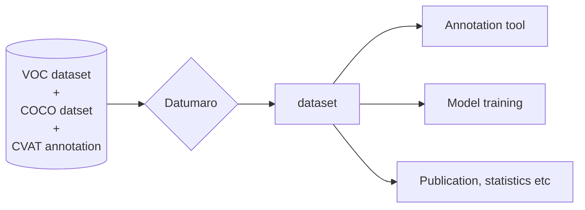

Welcome to the documentation for the Dataset Management Framework (Datumaro).

The Datumaro is a free framework and CLI tool for building, transforming,
and analyzing datasets.
It is developed and used by Intel to build, transform, and analyze annotations
and datasets in a large number of [supported formats](/docs/user-manual/supported-formats/).

Our documentation provides information for AI researchers, developers,
and teams, who are working with datasets and annotations.

<!--lint disable maximum-line-length-->
<section id="docs">



{}

Basic information and sections needed for a quick start.

{}

{}

This section contains documents for Datumaro users.

{}

{}

Documentation for Datumaro developers.

{}



</section>
<!--lint enable maximum-line-length-->
