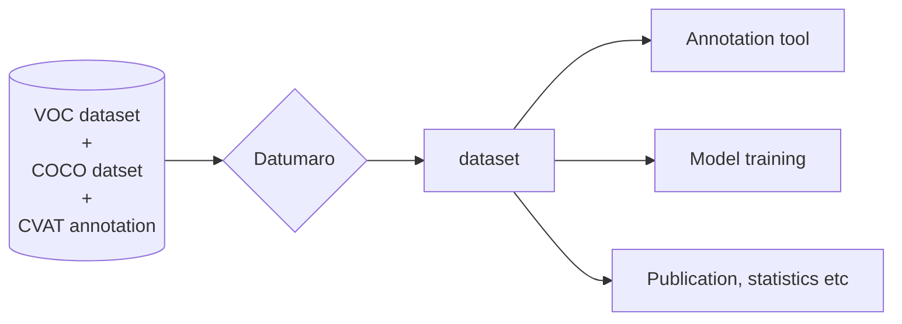

## Dataset Management Framework (Datumaro)

A framework and CLI tool to build, transform, and analyze datasets.

<section id="docs">



{}

Basic information and sections needed for a quick start.

{}

{}

This section contains documents for Datumaro users.

{}

{}

Documentation for Datumaro developers.

{}



</section>
