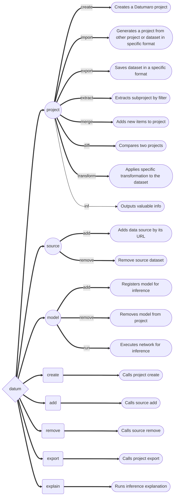
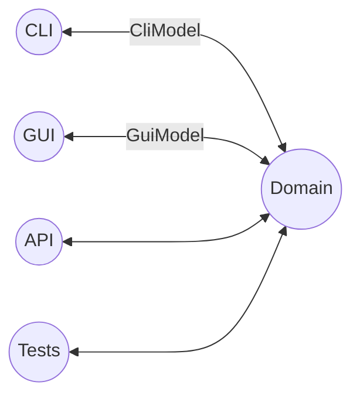

## Basics

The center part of the library is the `Dataset` class, which represents
a dataset and allows to iterate over its elements.
`DatasetItem`, an element of a dataset, represents a single
dataset entry with annotations - an image, video sequence, audio track etc.
It can contain only annotated data or meta information, only annotations, or
all of this.

Basic library usage and data flow:

```lang-none
Extractors -> Dataset -> Converter
                 |
             Filtration
          Transformations
             Statistics
              Merging
             Inference
          Quality Checking
             Comparison
                ...
```

1. Data is read (or produced) by one or many `Extractor`s and merged
  into a `Dataset`
1. The dataset is processed in some way
1. The dataset is saved with a `Converter`

Datumaro has a number of dataset and annotation features:
- iteration over dataset elements
- filtering of datasets and annotations by a custom criteria
- working with subsets (e.g. `train`, `val`, `test`)
- computing of dataset statistics
- comparison and merging of datasets
- various annotation operations

```python
from datumaro.components.dataset import Dataset
from datumaro.components.extractor import Bbox, Polygon, DatasetItem

# Import and export a dataset
dataset = Dataset.import_from('src/dir', 'voc')
dataset.export('dst/dir', 'coco')

# Create a dataset, convert polygons to masks, save in PASCAL VOC format
dataset = Dataset.from_iterable([
  DatasetItem(id='image1', annotations=[
    Bbox(x=1, y=2, w=3, h=4, label=1),
    Polygon([1, 2, 3, 2, 4, 4], label=2, attributes={'occluded': True}),
  ]),
], categories=['cat', 'dog', 'person'])
dataset.transform('polygons_to_masks')
dataset.export('dst/dir', 'voc')
```

### The Dataset class

The `Dataset` class from the `datumaro.components.dataset` module represents
a dataset, consisting of multiple `DatasetItem`s. Annotations are
represented by members of the `datumaro.components.extractor` module,
such as `Label`, `Mask` or `Polygon`. A dataset can contain items from one or
multiple subsets (e.g. `train`, `test`, `val` etc.), the list of dataset subsets
is available at `dataset.subsets`.

Datasets typically have annotations, and these annotations can
require additional information to be interpreted correctly. For instance, it
can include class names, class hierarchy, keypoint connections,
class colors for masks, class attributes.
This information is stored in `dataset.categories`, which is a mapping from
`AnnotationType` to a corresponding `...Categories` class. Each annotation type
can have its `Categories`. Typically, there will be a `LabelCategories` object.
Annotations and other categories address dataset labels
by their indices in this object.

The main operation for a dataset is iteration over its elements.
An item corresponds to a single image, a video sequence, etc. There are also
few other operations available, such as filtration (`dataset.select`) and
transformations (`dataset.transform`). A dataset can be created from extractors
or other datasets with `Dataset.from_extractors()` and directly from items with
`Dataset.from_iterable()`. A dataset is an extractor itself. If it is created
from multiple extractors, their categories must match, and their contents
will be merged.

A dataset item is an element of a dataset. Its `id` is a name of a
corresponding image. There can be some image `attributes`,
an `image` and `annotations`.

```python
from datumaro.components.dataset import Dataset
from datumaro.components.extractor import Bbox, Polygon, DatasetItem

# create a dataset from other datasets
dataset = Dataset.from_extractors(dataset1, dataset2)

# or directly from items
dataset = Dataset.from_iterable([
  DatasetItem(id='image1', annotations=[
    Bbox(x=1, y=2, w=3, h=4, label=1),
    Polygon([1, 2, 3, 2, 4, 4], label=2),
  ]),
], categories=['cat', 'dog', 'person'])

# keep only annotated images
dataset.select(lambda item: len(item.annotations) != 0)

# change dataset labels
dataset.transform('remap_labels',
  {'cat': 'dog', # rename cat to dog
    'truck': 'car', # rename truck to car
    'person': '', # remove this label
  }, default='delete')

# iterate over elements
for item in dataset:
  print(item.id, item.annotations)

# iterate over subsets as Datasets
for subset_name, subset in dataset.subsets().items():
  for item in subset:
    print(item.id, item.annotations)
```

### Projects

Projects are intended for complex use of Datumaro. They provide means of
persistence, of extending, and CLI operation for Datasets. A project can
be converted to a Dataset with `project.make_dataset`. Project datasets
can have multiple data sources, which are merged on dataset creation. They
can have a hierarchy. Project configuration is available in `project.config`.
A dataset can be saved in `datumaro_project` format.

The `Environment` class is responsible for accessing built-in and
project-specific plugins. For a project, there is an instance of
related `Environment` in `project.env`.

## Library contents

### Dataset Formats

The framework provides functions to read and write datasets in specific formats.
It is supported by `Extractor`s, `Importer`s, and `Converter`s.

Dataset reading is supported by `Extractor`s and `Importer`s:
- An `Extractor` produces a list of `DatasetItem`s corresponding to the
  dataset. Annotations are available in the `DatasetItem.annotations` list
- An `Importer` creates a project from a data source location

It is possible to add custom `Extractor`s and `Importer`s. To do this, you need
to put an `Extractor` and `Importer` implementations to a plugin directory.

Dataset writing is supported by `Converter`s.
A `Converter` produces a dataset of a specific format from dataset items.
It is possible to add custom `Converter`s. To do this, you need to put a
`Converter` implementation script to a plugin directory.


### Dataset Conversions ("Transforms")

A `Transform` is a function for altering a dataset and producing a new one.
It can update dataset items, annotations, classes, and other properties.
A list of available transforms for dataset conversions can be extended by
adding a `Transform` implementation script into a plugin directory.

### Model launchers

A list of available launchers for model execution can be extended by
adding a `Launcher` implementation script into a plugin directory.

## Plugins

Datumaro comes with a number of built-in formats and other tools,
but it also can be extended by plugins. Plugins are optional components,
which dependencies are not installed by default.
In Datumaro there are several types of plugins, which include:
- `extractor` - produces dataset items from data source
- `importer` - recognizes dataset type and creates project
- `converter` - exports dataset to a specific format
- `transformation` - modifies dataset items or other properties
- `launcher` - executes models

A plugin is a regular Python module. It must be present in a plugin directory:
- `<project_dir>/.datumaro/plugins` for project-specific plugins
- `<datumaro_dir>/plugins` for global plugins

A plugin can be used either via the `Environment` class instance,
or by regular module importing:

```python
from datumaro.components.project import Environment, Project
from datumaro.plugins.yolo_format.converter import YoloConverter

# Import a dataset
dataset = Environment().make_importer('voc')(src_dir).make_dataset()

# Load an existing project, save the dataset in some project-specific format
project = Project.load('project/dir')
project.env.converters.get('custom_format').convert(dataset, save_dir=dst_dir)

# Save the dataset in some built-in format
Environment().converters.get('yolo').convert(dataset, save_dir=dst_dir)
YoloConverter.convert(dataset, save_dir=dst_dir)
```

### Writing a plugin

A plugin is a Python module with any name, which exports some symbols. Symbols,
starting with `_` are not exported by default. To export a symbol,
inherit it from one of the special classes:

```python
from datumaro.components.extractor import Importer, Extractor, Transform
from datumaro.components.launcher import Launcher
from datumaro.components.converter import Converter
```

The `exports` list of the module can be used to override default behaviour:
```python
class MyComponent1: ...
class MyComponent2: ...
exports = [MyComponent2] # exports only MyComponent2
```

There is also an additional class to modify plugin appearance in command line:

```python
from datumaro.components.cli_plugin import CliPlugin

class MyPlugin(Converter, CliPlugin):
  """
    Optional documentation text, which will appear in command-line help
  """

  NAME = 'optional_custom_plugin_name'

  def build_cmdline_parser(self, **kwargs):
    parser = super().build_cmdline_parser(**kwargs)
    # set up argparse.ArgumentParser instance
    # the parsed args are supposed to be used as invocation options
    return parser
```

#### Plugin example

<!--lint disable fenced-code-flag-->

```
datumaro/plugins/
- my_plugin1/file1.py
- my_plugin1/file2.py
- my_plugin2.py
```

<!--lint enable fenced-code-flag-->

`my_plugin1/file2.py` contents:

```python
from datumaro.components.extractor import Transform, CliPlugin
from .file1 import something, useful

class MyTransform(Transform, CliPlugin):
    NAME = "custom_name" # could be generated automatically

    """
    Some description. The text will be displayed in the command line output.
    """

    @classmethod
    def build_cmdline_parser(cls, **kwargs):
        parser = super().build_cmdline_parser(**kwargs)
        parser.add_argument('-q', help="Very useful parameter")
        return parser

    def __init__(self, extractor, q):
        super().__init__(extractor)
        self.q = q

    def transform_item(self, item):
        return item
```

`my_plugin2.py` contents:

```python
from datumaro.components.extractor import Extractor

class MyFormat: ...
class _MyFormatConverter(Converter): ...
class MyFormatExtractor(Extractor): ...

exports = [MyFormat] # explicit exports declaration
# MyFormatExtractor and _MyFormatConverter won't be exported
```

## Command-line

Basically, the interface is divided on contexts and single commands.
Contexts are semantically grouped commands, related to a single topic or target.
Single commands are handy shorter alternatives for the most used commands
and also special commands, which are hard to be put into any specific context.
[Docker](https://www.docker.com/) is an example of similar approach.

<div class="text-center large-scheme">



</div>

Model-View-ViewModel (MVVM) UI pattern is used.

<div class="text-center">



</div>
