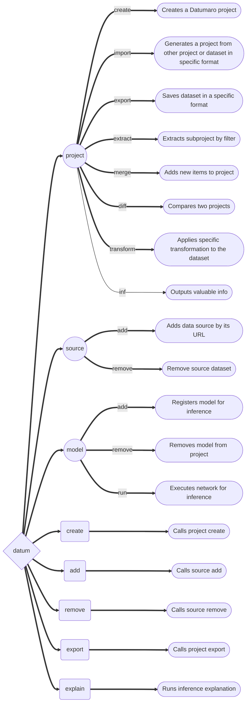

> **Note**: command invocation syntax is subject to change,
> **always refer to command --help output**

Available CLI commands:

```mermaid
flowchart LR
    d{datum}
    p((project))
    s((source))
    m((model))
    d==>p
    p==create===>str1([Creates a Datumaro project])
    p==import===>str2([Generates a project from other project or dataset in specific format])
    p==export===>str3([Saves dataset in a specific format])
    p==extract===>str4([Extracts subproject by filter])
    p==merge===>str5([Adds new items to project])
    p==diff===>str6([Compares two projects])
    p==transform===>str7([Applies specific transformation to the dataset])
    p==info===>str8([Outputs valuable info])
    d==>s
    s==add===>str9([Adds data source by its URL])
    s==remove===>str10([Remove source dataset])
    d==>m
    m==add===>str11([Registers model for inference])
    m==remove===>str12([Removes model from project])
    m==run===>str13([Executes network for inference])
    d==>c(create)===>str14([Calls project create])
    d==>a(add)===>str15([Calls source add])
    d==>r(remove)===>str16([Calls source remove])
    d==>e(export)===>str17([Calls project export])
    d==>exp(explain)===>str18([Runs inference explanation])
```

