<div class="text-center large-scheme-two">



</div>

```mermaid
%%{init { 'theme':'neutral' }}%%
flowchart LR
  d(("#0009; datum #0009;")):::mainclass
  s(source):::nofillclass
  m(model):::nofillclass
  p(project):::nofillclass

  d===s
    s===id1[add]:::hideclass
    s===id2[remove]:::hideclass
    s===id3[info]:::hideclass
  d===m
    m===id4[add]:::hideclass
    m===id5[remove]:::hideclass
    m===id6[run]:::hideclass
    m===id7[info]:::hideclass
  d===p
    p===migrate:::hideclass
    p===info:::hideclass
  d====str1[create]:::filloneclass
  d====str2[import]:::filloneclass
  d====str3[export]:::filloneclass
  d====str4[add]:::filloneclass
  d====str5[remove]:::filloneclass
  d====str6[info]:::filloneclass
  d====str7[transform]:::filltwoclass
  d====str8[filter]:::filltwoclass
  d====str9[diff]:::fillthreeclass
  d====str10[merge]:::fillthreeclass
  d====str11[patch]:::fillthreeclass
  d====str12[validate]:::fillthreeclass
  d====str13[explain]:::fillthreeclass
  d====str14[stats]:::fillthreeclass
  d====str15[commit]:::fillfourclass
  d====str16[checkout]:::fillfourclass
  d====str17[status]:::fillfourclass
  d====str18[log]:::fillfourclass

  classDef nofillclass fill-opacity:0;
  classDef hideclass fill-opacity:0,stroke-opacity:0;
  classDef filloneclass fill:#CCCCFF,stroke-opacity:0;
  classDef filltwoclass fill:#FFFF99,stroke-opacity:0;
  classDef fillthreeclass fill:#CCFFFF,stroke-opacity:0;
  classDef fillfourclass fill:#CCFFCC,stroke-opacity:0;
```

The command line is split into the separate _commands_ and command _contexts_.
Contexts group multiple commands related to a specific topic, e.g.
project operations, data source operations etc. Almost all the commands
operate on projects, so the `project` context and commands without a context
are mostly the same. By default, commands look for a project in the current
directory. If the project you're working on is located somewhere else, you
can pass the `-p/--project <path>` argument to the command.

> **Note**: command behavior is subject to change, so this text might be
  outdated,
> **always check the `--help` output of the specific command**

> **Note**: command parameters must be passed prior to the positional arguments.

Datumaro functionality is available with the `datum` command.

Usage:
``` bash
datum [-h] [--version] [--loglevel LOGLEVEL] [command] [command args]
```

Parameters:
- `--loglevel` (string) - Logging level, one of
  `debug`, `info`, `warning`, `error`, `critical` (default: `info`)
- `--version` - Print the version number and exit.
- `-h, --help` - Print the help message and exit.
